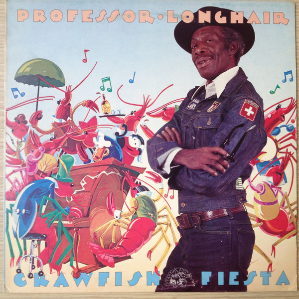

# Crawfish Fiesta

By Professor Longhair

## Album Data

[Discogs URL](https://www.discogs.com/release/4036468-Professor-Longhair-Crawfish-Fiesta)

- Label: Alligator Records
- Formats: Vinyl, LP, Album, Reissue, Remastered
- Genres: Funk / Soul, Blues, Louisiana Blues, Funk
- Rating: 4.5
- Released: 2012-10-16
- Year: 1980
- Release ID: 4036468
- Media condition: 
- Sleeve condition: 
- Speed: 
- Weight: 
- Notes: 

## Album Tracks

| **Position** | **Title** | **Duration** |
|--------------|-----------|--------------|
| A1 | **Big Chief** | 3:13 |
| A2 | **Her Mind Is Gone** | 4:23 |
| A3 | **Something On Your Mind** | 4:10 |
| A4 | **You're Driving Me Crazy** | 2:34 |
| A5 | **Red Beans** | 4:09 |
| A6 | **Willie Fugal's Blues** | 2:03 |
| B1 | **It's My Fault, Darling** | 4:54 |
| B2 | **In The Wee Wee Hours** | 3:23 |
| B3 | **Cry To Me** | 3:35 |
| B4 | **Bald Head** | 2:58 |
| B5 | **Whole Lotta Loving** | 3:46 |
| B6 | **Crawfish Fiesta** | 3:10 |
| B7 | **River's Invitation** | 3:14 |

## Artist Roles

| **Name** | **Role** |
|----------|----------|
| **Andy Kaslow** | Arranged By [Horns] |
| **Tony Dagradi** | Arranged By [Horns] |
| **Jim Moore (3)** | Baritone Saxophone |
| **David Lee Watson** | Bass |
| **Alfred Roberts** | Congas |
| **Ross & Harvey Inc.** | Design [Album Design] |
| **Johnny Vidacovich** | Drums |
| **Eddie B. Flick** | Engineer [Mixing Assisted By] |
| **Skip Godwin** | Engineer [Recording Associate Engineer] |
| **Mac Rebennack** | Guitar |
| **Mark Richardson (3)** | Lacquer Cut By |
| **Mindy Giles** | Liner Notes |
| **Tad Jones (2)** | Liner Notes |
| **Mac Rebennack** | Musical Assistance [Invaluable Production Assistance By] |
| **Michael P. Smith (2)** | Photography By |
| **Professor Longhair** | Piano, Vocals |
| **Allison Kaslow** | Producer |
| **Andy Kaslow** | Producer |
| **Bruce Iglauer** | Producer |
| **Fred Breitberg** | Recorded By, Mixed By |
| **Andy Kaslow** | Tenor Saxophone |
| **Tony Dagradi** | Tenor Saxophone |
| **Walton Payton** | Tuba |

