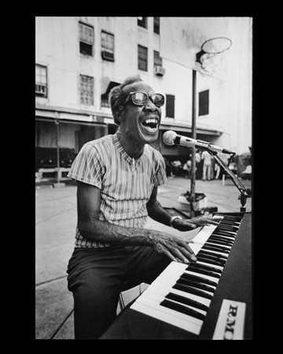

# Professor Longhair

## Artist Profile

American pianist, vocalist and songwriter. 
Born 19 December 1918 in Bogalusa, Louisiana, USA. 
Died 30 January 1980 in New Orleans, Louisiana, USA. 
Professor Longhair can be considered as the creator of the New Orleans Rhythm & Blues. Musically active from 1949 to 1964, he made a comeback in the early 1970s. Inducted into Rock And Roll Hall of Fame in 1992 (Early Influence).

## Artist Links

- [https://en.wikipedia.org/wiki/Professor_Longhair](https://en.wikipedia.org/wiki/Professor_Longhair)
- [https://myspace.com/professorlonghair1](https://myspace.com/professorlonghair1)

## See also

- [Crawfish Fiesta](Crawfish_Fiesta.md)
- [Go To The Mardi Gras / Everyday, Everynight](Go_To_The_Mardi_Gras_-_Everyday__Everynight.md)
- [New Orleans Piano](New_Orleans_Piano.md)
