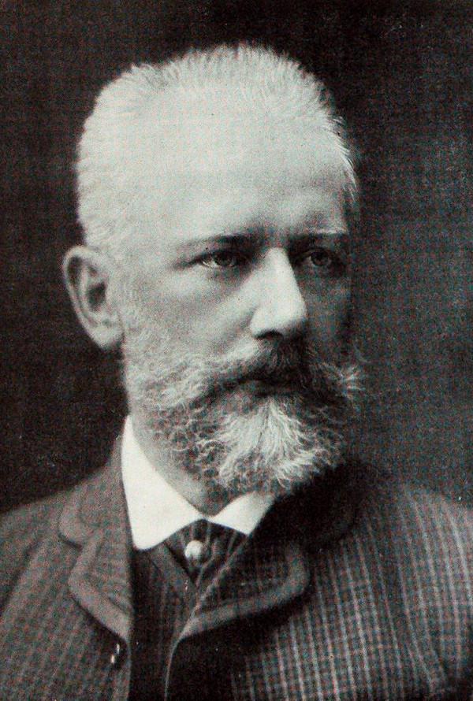

# Pyotr Ilyich Tchaikovsky

## Artist Profile

Russian composer from the Romantic era (born 25. April 1840 in Kamsko-Votkinsk Zavod - died 25. October 1893 in Saint Petersburg).

## Artist Links

- [http://www.tchaikovsky-research.org/](http://www.tchaikovsky-research.org/)
- [https://en.wikipedia.org/wiki/Pyotr_Ilyich_Tchaikovsky](https://en.wikipedia.org/wiki/Pyotr_Ilyich_Tchaikovsky)
- [https://www.imdb.com/name/nm0006318/](https://www.imdb.com/name/nm0006318/)

## See also

- [Symphony Nr. 5](Symphony_Nr_5.md)
