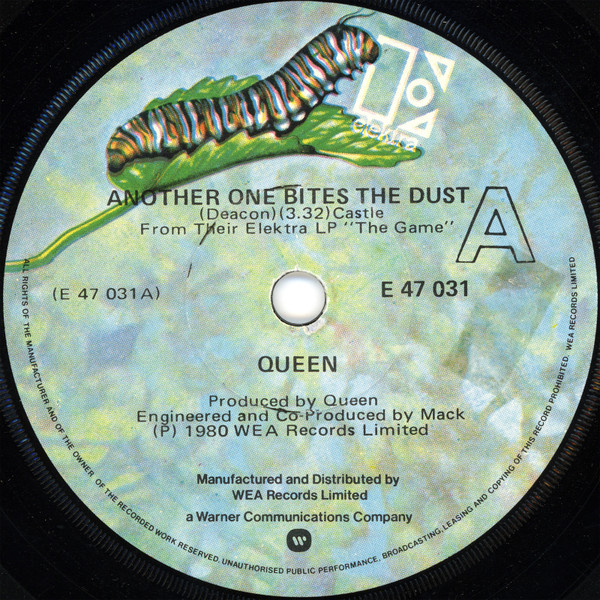

# Another One Bites The Dust

By Queen

## Album Data

[Discogs URL](https://www.discogs.com/release/3240510-Queen-Another-One-Bites-The-Dust)

- Label: Elektra
- Formats: Vinyl, 7", 45 RPM, Single, Styrene, Stereo
- Genres: Rock, Pop Rock, Classic Rock
- Rating: 4.28
- Released: 1980
- Year: 1980
- Release ID: 3240510
- Media condition: 
- Sleeve condition: 
- Speed: 
- Weight: 
- Notes: 

## Album Tracks

| **Position** | **Title** | **Duration** |
|--------------|-----------|--------------|
| A | **Another One Bites The Dust** | 3:32 |
| B | **Don't Try Suicide** | 3:50 |

## Artist Roles

| **Name** | **Role** |
|----------|----------|
| **Mack (2)** | Engineer, Co-producer |
| **Queen** | Producer |

