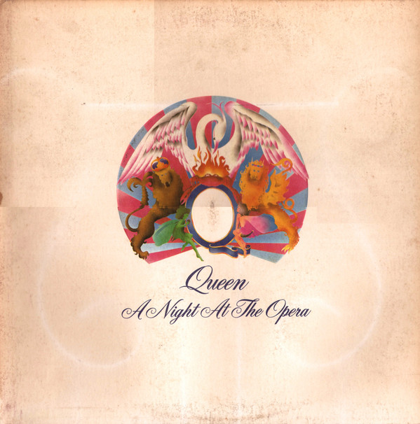

# A Night At The Opera

By Queen

## Album Data

[Discogs URL](https://www.discogs.com/release/2170885-Queen-A-Night-At-The-Opera)

- Label: Hollywood Records
- Formats: Vinyl, LP, Album, Reissue, Remastered, Repress
- Genres: Rock, Hard Rock, Pop Rock, Classic Rock
- Rating: 4.56
- Released: 2008-10-09
- Year: 1975
- Release ID: 2170885
- Media condition: 
- Sleeve condition: 
- Speed: 
- Weight: 
- Notes: 

## Album Tracks

| **Position** | **Title** | **Duration** |
|--------------|-----------|--------------|
| A1 | **Death On Two Legs (Dedicated To...)** |  |
| A2 | **Lazing On A Sunday Afternoon** |  |
| A3 | **I'm In Love WIth My Car** |  |
| A4 | **You're My Best Friend** |  |
| A5 | **'39** |  |
| A6 | **Sweet Lady** |  |
| A7 | **Seaside Rendezvous** |  |
| B1 | **The Prophet's Song** |  |
| B2 | **Love Of My Life** |  |
| B3 | **Good Company** |  |
| B4 | **Bohemian Rhapsody** |  |
| B5 | **God Save The Queen** |  |

## Artist Roles

| **Name** | **Role** |
|----------|----------|
| **David Costa** | Art Direction |
| **John Harris** | Crew [Equipment Supervision] |
| **John Deacon** | Electric Bass |
| **Mike Stone** | Engineer [Executive Engineer] |
| **Gary Lyons** | Engineer [Invaluable Additional Engineering] |
| **Brian May** | Guitar, Orchestrated By [Orchestral Backdrops] |
| **John Reid (8)** | Management |
| **Roger Taylor** | Percussion |
| **Queen** | Producer [Produced By] |
| **Roy Thomas Baker** | Producer [Produced By] |
| **Freddie Mercury** | Vocals, Piano [Bechstein Debauchery] |

