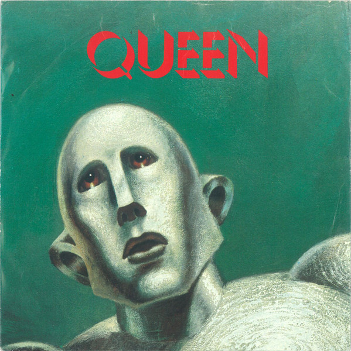

# We Are The Champions

By Queen

## Album Data

[Discogs URL](https://www.discogs.com/release/2430726-Queen-We-Are-The-Champions)

- Label: Elektra
- Formats: Vinyl, 7", 45 RPM, Single, Stereo
- Genres: Rock, Hard Rock, Glam, Arena Rock, Classic Rock
- Rating: 4.58
- Released: 1977-10-25
- Year: 1977
- Release ID: 2430726
- Media condition: 
- Sleeve condition: 
- Speed: 
- Weight: 
- Notes: 

## Album Tracks

| **Position** | **Title** | **Duration** |
|--------------|-----------|--------------|
| A | **We Are The Champions** | 3:00 |
| B | **We Will Rock You** | 2:01 |

## Artist Roles

| **Name** | **Role** |
|----------|----------|
| **Terry Dunavan** | Mastered By |
| **Queen** | Producer |
| **Mike Stone** | Producer [Assistant] |

