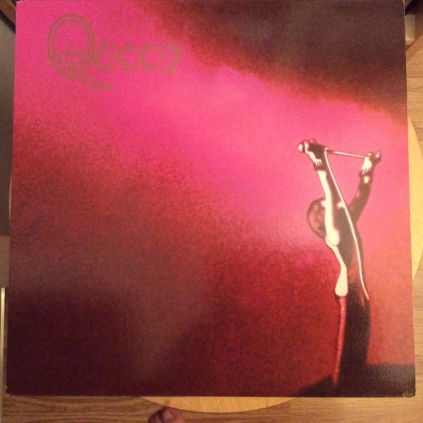

# Queen

By Queen

## Album Data

[Discogs URL](https://www.discogs.com/release/2326309-Queen-Queen)

- Label: Hollywood Records
- Formats: Vinyl, LP, Album, Reissue, Special Edition
- Genres: Rock, Arena Rock, Classic Rock, Hard Rock
- Rating: 4.46
- Released: 2009-08-31
- Year: 1973
- Release ID: 2326309
- Media condition: 
- Sleeve condition: 
- Speed: 
- Weight: 
- Notes: 

## Album Tracks

| **Position** | **Title** | **Duration** |
|--------------|-----------|--------------|
| A1 | **Keep Yourself Alive** |  |
| A2 | **Doing All Right** |  |
| A3 | **Great King Rat** |  |
| A4 | **My Fairy King** |  |
| B1 | **Liar** |  |
| B2 | **The Night Comes Down** |  |
| B3 | **Modern Times Rock 'N' Roll** |  |
| B4 | **Son And Daughter** |  |
| B5 | **Jesus** |  |
| B6 | **Seven Seas Of Rhye** |  |

## Artist Roles

| **Name** | **Role** |
|----------|----------|
| **John Deacon** | Bass Guitar |
| **Brian May** | Guitar, Piano, Vocals |
| **David Cheppa** | Lacquer Cut By |
| **Roger Taylor** | Percussion, Vocals |
| **John Anthony** | Producer |
| **Roy Thomas Baker** | Producer |
| **Freddie Mercury** | Vocals, Piano |
| **Brian May** | Written-By |
| **Freddie Mercury** | Written-By |
| **Roger Taylor** | Written-By |
| **Tim Staffell** | Written-By |

