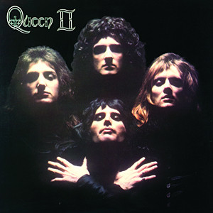

# Queen II

By Queen

## Album Data

[Discogs URL](https://www.discogs.com/release/3110951-Queen-Queen-II)

- Label: Hollywood Records
- Formats: Vinyl, LP, Album, Reissue, Remastered
- Genres: Rock, Art Rock, Glam, Hard Rock, Arena Rock
- Rating: 4.47
- Released: 2008-10-28
- Year: 1974
- Release ID: 3110951
- Media condition: 
- Sleeve condition: 
- Speed: 
- Weight: 
- Notes: 

## Album Tracks

| **Position** | **Title** | **Duration** |
|--------------|-----------|--------------|
|  | **Side White** |  |
| A1 | **Procession** |  |
| A2 | **Father To Son** |  |
| A3 | **White Queen (As It Began)** |  |
| A4 | **Some Day One Day** |  |
| A5 | **The Loser In The End** |  |
|  | **Side Black** |  |
| B1 | **Ogre Battle** |  |
| B2 | **The Fairy Feller's Master-Stroke** |  |
| B3 | **Nevermore** |  |
| B4 | **The March Of The Black Queen** |  |
| B5 | **Funny How Love Is** |  |
| B6 | **Seven Seas Of Rhye** |  |

## Artist Roles

| **Name** | **Role** |
|----------|----------|
| **Richard Dadd (2)** | Artwork [Inspired By A Painting By] |
| **John Deacon** | Bass Guitar, Acoustic Guitar |
| **Roy Thomas Baker** | Castanets [Virtuoso Castanets By] |
| **Mick Rock** | Concept By [Sleeve] |
| **Queen** | Concept By [Sleeve] |
| **Mike Stone** | Engineer [Engineered By] |
| **Brian May** | Guitar [Guitars], Piano, Vocals, Bells |
| **Jack Nelson** | Management [Management By] |
| **Roger Taylor** | Percussion, Vocals |
| **Mick Rock** | Photography By, Art Direction |
| **Robin Geoffrey Cable** | Producer [Additional Production By] |
| **Roy Thomas Baker** | Producer [Produced By] |
| **Queen** | Producer [Produced By], Producer [Additional Production By] |
| **Ridgeway Watt** | Typography [Typography By] |
| **Freddie Mercury** | Vocals, Piano, Harpsichord |

