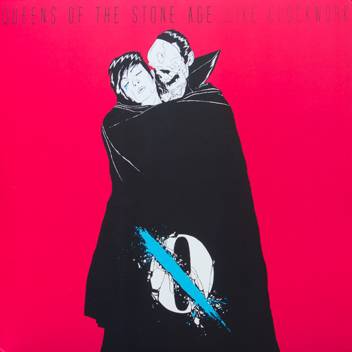

# ...Like Clockwork

By Queens Of The Stone Age

## Album Data

[Discogs URL](https://www.discogs.com/release/4608497-Queens-Of-The-Stone-Age-Like-Clockwork)

- Label: Matador
- Formats: Vinyl, 12", 45 RPM, Album
- Genres: Rock, Alternative Rock, Stoner Rock, Hard Rock
- Rating: 4.48
- Released: 2013-05-31
- Year: 2013
- Release ID: 4608497
- Media condition: 
- Sleeve condition: 
- Speed: 
- Weight: 
- Notes: 

## Album Tracks

| **Position** | **Title** | **Duration** |
|--------------|-----------|--------------|
| A1 | **Keep Your Eyes Peeled** |  |
| A2 | **I Sat By The Ocean** |  |
| A3 | **The Vampyre Of Time And Memory** |  |
| B1 | **If I Had A Tail** |  |
| B2 | **My God Is The Sun** |  |
| B3 | **Kalopsia** |  |
| C1 | **Fairweather Friends** |  |
| C2 | **Smooth Sailing** |  |
| D1 | **I Appear Missing** |  |
| D2 | **...Like Clockwork** |  |

## Artist Roles

| **Name** | **Role** |
|----------|----------|
| **Boneface** | Artwork |
| **Mark Rankin** | Engineer |
| **Alain Johannes** | Engineer [Additional] |
| **Justin Smith (51)** | Engineer [Additional] |
| **Chris Bellman** | Lacquer Cut By |
| **Josh Homme** | Lyrics By |
| **Gavin Lurssen** | Mastered By |
| **Joe Barresi** | Mixed By |
| **Mark Rankin** | Mixed By |
| **Dean Fertita** | Performer |
| **Josh Homme** | Performer |
| **Mikey Shuman** | Performer |
| **Troy Van Leeuwen** | Performer |
| **James Lavelle** | Producer |
| **Josh Homme** | Producer |
| **Queens Of The Stone Age** | Producer |
| **Charlie May** | Written-By |
| **James Lavelle** | Written-By |
| **Josh Homme** | Written-By |
| **Mark Lanegan** | Written-By |
| **Queens Of The Stone Age** | Written-By |

