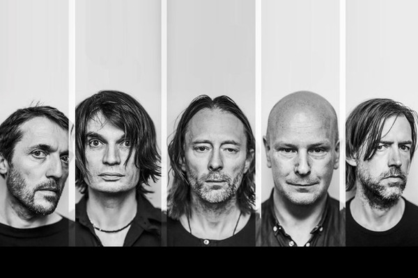

# Radiohead

## Artist Profile

Alternative Rock (Modern Rock) band from Oxfordshire, England (United Kingdom).

The name Radiohead comes from the Talking Heads song, "Radio Head", from the "True Stories" album. 

Formed by school friends in 1986, Radiohead did not release their first single until 1992's "Drill EP". The cathartic "Creep", from the debut album "Pablo Honey" (1993), became a worldwide hit as grunge music dominated radio airwaves. 

Radiohead were initially branded as a one-hit wonder abroad, but caught on at home in the UK with their second album, "The Bends" (1995), earning fans with their dense guitar atmospheres and front man Thom Yorke's expressive singing. The album featured the hits "High & Dry", "Just" and "Fake Plastic Trees". 

The band's third album, "OK Computer" (1997), propelled them to greater attention. Popular both for its expansive sound and themes of modern alienation, the album has been acclaimed by critics as a landmark record of the 1990's, some critics go as far to consider it one of the best of all time. "Kid A" (2000) marked further evolution, containing influences from experimental electronic music.

"Hail To The Thief" (2003) was seen as a conventional return to the guitar and piano-led rock sound. After fulfilling their contract with EMI, Radiohead released "In Rainbows" (2007) famously via a pay-what-you-want model. Their latest album, "A Moon Shaped Pool", was released in May 2016.
 
Radiohead's original influences were cited as alternative rock and post-punk bands like The Smiths, Pixies, Magazine, Joy Division, Siouxsie &amp; The Banshees, who Thom Yorke claims inspired him to become a performer, and R.E.M. (with lead singer of the band, Thom Yorke, refering to himself as an 'R.E.M. groupie').

## Artist Links

- [https://www.radiohead.com/](https://www.radiohead.com/)
- [https://radiohead.bandcamp.com/](https://radiohead.bandcamp.com/)
- [https://www.facebook.com/radiohead](https://www.facebook.com/radiohead)
- [https://www.instagram.com/radiohead](https://www.instagram.com/radiohead)
- [https://myspace.com/radiohead](https://myspace.com/radiohead)
- [http://www.progarchives.com/artist.asp?id=1492](http://www.progarchives.com/artist.asp?id=1492)
- [https://twitter.com/radiohead](https://twitter.com/radiohead)
- [https://www.whosampled.com/Radiohead/](https://www.whosampled.com/Radiohead/)
- [https://en.wikipedia.org/wiki/Radiohead](https://en.wikipedia.org/wiki/Radiohead)
- [https://www.youtube.com/user/radiohead](https://www.youtube.com/user/radiohead)

## See also

- [OK Computer](OK_Computer.md)
