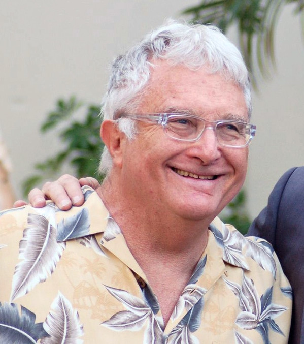

# Randy Newman

## Artist Profile

American singer-songwriter, born 28 November 1943 in Los Angeles, California, USA.

Inducted into Rock And Roll Hall of Fame in 2013 (Performer).
Inducted into the Songwriters Hall of Fame in 2002.

## Artist Links

- [http://www.randynewman.com/](http://www.randynewman.com/)
- [https://www.facebook.com/RandyNewman](https://www.facebook.com/RandyNewman)
- [https://twitter.com/randynewman](https://twitter.com/randynewman)
- [https://www.youtube.com/channel/UCI2zfGHCt68rzyGepRsr7wA](https://www.youtube.com/channel/UCI2zfGHCt68rzyGepRsr7wA)
- [https://www.instagram.com/randynewmanofficial/](https://www.instagram.com/randynewmanofficial/)
- [https://myspace.com/randynewman2](https://myspace.com/randynewman2)
- [https://en.wikipedia.org/wiki/Randy_Newman](https://en.wikipedia.org/wiki/Randy_Newman)
- [https://www.imdb.com/name/nm0005271/](https://www.imdb.com/name/nm0005271/)
- [https://www.songhall.org/profile/Randy_Newman](https://www.songhall.org/profile/Randy_Newman)

## See also

- [The Randy Newman Songbook](The_Randy_Newman_Songbook.md)
