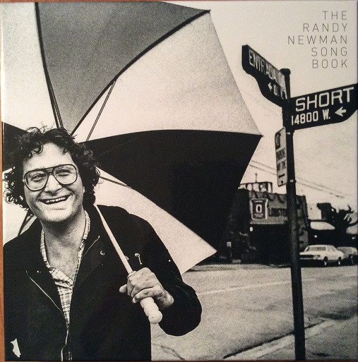

# The Randy Newman Songbook

By Randy Newman

## Album Data

[Discogs URL](https://www.discogs.com/release/9110801-Randy-Newman-The-Randy-Newman-Songbook)

- Label: Nonesuch
- Formats: Vinyl
Box Set, LP, Compilation, Limited Edition
- Genres: Rock, Pop, Pop Rock, Vocal
- Rating: 4.45
- Released: 2016-09-23
- Year: 2016
- Release ID: 9110801
- Media condition: 
- Sleeve condition: 
- Speed: 
- Weight: 
- Notes: 

## Album Tracks

| **Position** | **Title** | **Duration** |
|--------------|-----------|--------------|
| A1 | **I Think It’s Going To Rain Today** | 2:59 |
| A2 | **It’s Lonely At The Top** | 2:17 |
| A3 | **God’s Song (That’s Why I Love Mankind)** | 3:26 |
| A4 | **Rednecks** | 3:07 |
| A5 | **Let Me Go** | 2:40 |
| A6 | **Living Without You** | 2:18 |
| A7 | **You Can Leave Your Hat On** | 2:33 |
| B1 | **Ragtime** | 1:27 |
| B2 | **It's Money That I Love** | 2:19 |
| B3 | **Political Science** | 2:05 |
| B4 | **The World Isn't Fair** | 3:10 |
| B5 | **In Germany Before The War** | 3:51 |
| B6 | **The Great Nations Of Europe** | 3:28 |
| B7 | **Marie** | 2:57 |
| C1 | **Louisiana 1927** | 2:59 |
| C2 | **Dixie Flyer** | 3:20 |
| C3 | **Yellow Man** | 2:06 |
| C4 | **Suzanne** | 2:48 |
| C5 | **The Girls In My Life (Part 1)** | 1:48 |
| C6 | **Kingfish** | 2:14 |
| C7 | **Short People** | 2:09 |
| D1 | **When She Loved Me** | 1:05 |
| D2 | **Losing You** | 2:47 |
| D3 | **My Life Is Good** | 3:28 |
| D4 | **Birmingham** | 2:23 |
| D5 | **Last Night I Had A Dream** | 1:57 |
| D6 | **Laugh And Be Happy** | 2:24 |
| D7 | **Cowboy** | 2:23 |
| E1 | **Sail Away** | 3:01 |
| E2 | **Mama Told Me Not To Come** | 1:56 |
| E3 | **Love Story (You And Me)** | 3:05 |
| E4 | **Burn On** | 2:31 |
| E5 | **Rollin'** | 2:33 |
| E6 | **Guilty** | 2:47 |
| E7 | **You've Got A Friend In Me** | 2:06 |
| F1 | **Avalon** | 1:01 |
| F2 | **Simon Smith And The Amazing Dancing Bear** | 1:48 |
| F3 | **Davy The Fat Boy** | 2:40 |
| F4 | **Lucinda** | 1:39 |
| F5 | **Baltimore** | 3:06 |
| F6 | **Real Emotional Girl** | 2:33 |
| F7 | **Sandman's Coming** | 2:18 |
| G1 | **Feels Like Home** | 4:53 |
| G2 | **I Love To See You Smile** | 2:26 |
| G3 | **A Wedding In Cherokee County** | 2:59 |
| G4 | **Red Bandana** | 2:21 |
| G5 | **Bad News From Home** | 3:00 |
| G6 | **Same Girl** | 2:47 |
| G7 | **I Love L.A.** | 2:33 |
| H1 | **Family Album: Homage To Alfred, Emil And Lionel Newman** | 1:02 |
| H2 | **Old Man** | 2:38 |
| H3 | **Dayton, Ohio - 1903** | 1:55 |
| H4 | **A Few Words In Defense Of Our Country** | 4:08 |
| H5 | **I'm Dreaming** | 3:15 |
| H6 | **I'll Be Home** | 2:27 |
| H7 | **Wandering Boy** | 3:02 |

## Artist Roles

| **Name** | **Role** |
|----------|----------|
| **Michael Carney** | Art Direction, Design |
| **Lenny Waronker** | Co-producer |
| **Mitchell Froom** | Co-producer |
| **Robert Edridge-Waks** | Coordinator [Editorial Coordinator] |
| **Arthur Moorhead** | Coordinator [Production Coordinator] |
| **David Boucher** | Engineer |
| **Steven Rhodes** | Engineer [Assistant Engineer At Sound Factory] |
| **Seth Waldmann** | Engineer [Assistant Engineer In 2003] |
| **Cathy Kerr** | Executive-Producer |
| **Robert Hurwitz** | Executive-Producer |
| **Jon Ronson** | Liner Notes |
| **Robert Hurwitz** | Liner Notes |
| **Bob Ludwig** | Mastered By |
| **Chris Bellman** | Mastered By [Vinyl] |
| **Mark Sennet** | Photography By |
| **Karina Beznicki** | Supervised By [Production Supervisor] |

