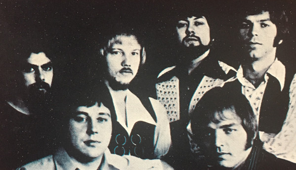

# Rare Earth

## Artist Profile

American Psychedelic Rock/ Psychedelic Soul group from Detroit, Michigan.

The main personnel in the group were 
Gil Bridges, saxophone, flute, vocals; 
Peter Hoorelbeke (aka Peter Rivera), lead vocals, drums; 
John Parrish (aka John Persh), bass guitar, trombone, vocals; 
Rod Richards (born Rod Cox), guitar, vocals; 
Kenny James (born Ken Folcik), keyboards. 

In late 1969, Edward "Eddie" Guzman (congas and assorted percussive instruments) was added to the group.

## Artist Links

- [http://www.rareearth.com/](http://www.rareearth.com/)
- [https://en.wikipedia.org/wiki/Rare_Earth_(band)](https://en.wikipedia.org/wiki/Rare_Earth_(band))
- [https://www.imdb.com/name/nm1998966/](https://www.imdb.com/name/nm1998966/)

## See also

- [Get Ready](Get_Ready.md)
