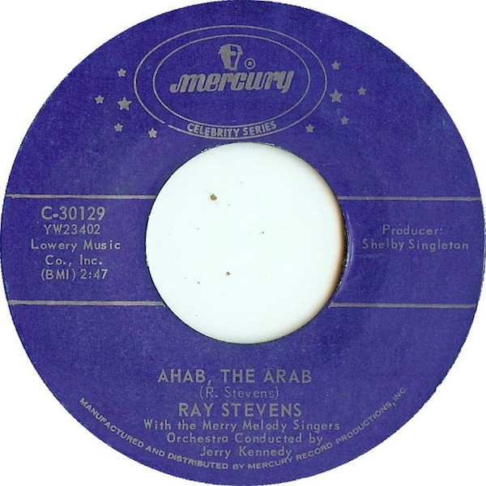

# Ahab, The Arab 

By Ray Stevens

## Album Data

[Discogs URL](https://www.discogs.com/release/4336216-Ray-Stevens-With-The-Merry-Melody-Singers-AhabArab-)

- Label: Mercury
- Formats: Vinyl, 7", 45 RPM, Single, Reissue
- Genres: Rock, Pop, Novelty
- Rating: 4.2
- Released: 1965
- Year: 1965
- Release ID: 4336216
- Media condition: 
- Sleeve condition: 
- Speed: 
- Weight: 
- Notes: 

## Album Tracks

| **Position** | **Title** | **Duration** |
|--------------|-----------|--------------|
| A | **Ahab, The Arab** | 2:47 |
| B | **Harry The Hairy Ape** | 2:47 |

## Artist Roles

| **Name** | **Role** |
|----------|----------|
| **Shelby S Singleton Jr.** | Producer |

