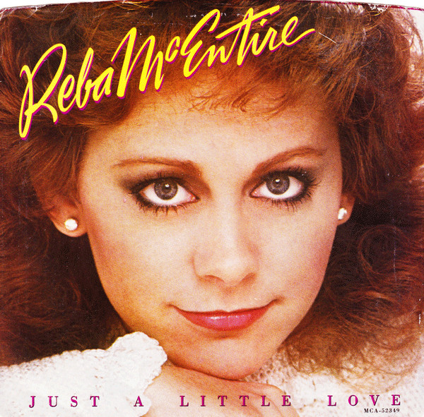

# Just A Little Love

By Reba McEntire

## Album Data

[Discogs URL](https://www.discogs.com/release/3353111-Reba-McEntire-Just-A-Little-Love)

- Label: MCA Records
- Formats: Vinyl, 7", 45 RPM, Single
- Genres: Folk, World, & Country, Country
- Rating: 0
- Released: 1984
- Year: 1984
- Release ID: 3353111
- Media condition: 
- Sleeve condition: 
- Speed: 
- Weight: 
- Notes: 

## Album Tracks

| **Position** | **Title** | **Duration** |
|--------------|-----------|--------------|
| A | **Just A Little Love** | 4:01 |
| B | **If Your Heart's Not In It (What's In It For Me)** | 2:23 |

## Artist Roles

| **Name** | **Role** |
|----------|----------|
| **Randy Kling** | Mastered By [Runout Etchings] |
| **Norro Wilson** | Producer |

