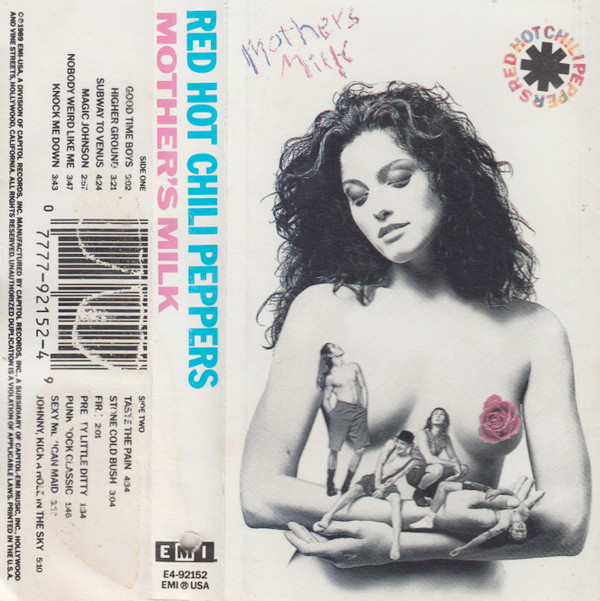

# Mother's Milk

By Red Hot Chili Peppers

## Album Data

[Discogs URL](https://www.discogs.com/release/1828402-Red-Hot-Chili-Peppers-Mothers-Milk)

- Label: EMI USA
- Formats: Vinyl, LP, Album, Limited Edition, Reissue
- Genres: Rock, Alternative Rock, Funk Metal
- Rating: 4.37
- Released: 2009-06-16
- Year: 1989
- Release ID: 1828402
- Media condition: 
- Sleeve condition: 
- Speed: 
- Weight: 
- Notes: 

## Album Tracks

| **Position** | **Title** | **Duration** |
|--------------|-----------|--------------|
| A1 | **Good Time Boys** | 4:51 |
| A2 | **Higher Ground** | 3:15 |
| A3 | **Subway To Venus** | 4:17 |
| A4 | **Magic Johnson** | 2:47 |
| A5 | **Nobody Weird Like Me** | 3:45 |
| A6 | **Knock Me Down** | 4:35 |
| B1 | **Taste The Pain** | 4:20 |
| B2 | **Stone Cold Bush** | 2:58 |
| B3 | **Fire** | 2:20 |
| B4 | **Pretty Little Ditty (re-release version)** | 3:07 |
| B5 | **Punk Rock Classic** | 1:37 |
| B6 | **Sexy Mexican Maid** | 3:40 |
| B7 | **Johnny, Kick A Hole In The Sky** | 5:08 |

## Artist Roles

| **Name** | **Role** |
|----------|----------|
| **Ron McMaster** | Lacquer Cut By |
| **Dave Jerden** | Mixed By |
| **Michael Beinhorn** | Producer |
| **D.H. Peligro** | Written-By |
| **Red Hot Chili Peppers** | Written-By |

