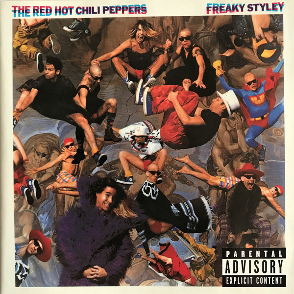

# Freaky Styley

By Red Hot Chili Peppers

## Album Data

[Discogs URL](https://www.discogs.com/release/687169-The-Red-Hot-Chili-Peppers-Freaky-Styley)

- Label: EMI America
Enigma Records (3)
- Formats: Vinyl, LP, Album, Stereo
- Genres: Rock, Alternative Rock, Funk Metal
- Rating: 4.11
- Released: 1985
- Year: 1985
- Release ID: 687169
- Media condition: 
- Sleeve condition: 
- Speed: 
- Weight: 
- Notes: 

## Album Tracks

| **Position** | **Title** | **Duration** |
|--------------|-----------|--------------|
| A1 | **Jungle Man** | 4:04 |
| A2 | **Hollywood (Africa)** | 4:58 |
| A3 | **American Ghost Dance** | 3:40 |
| A4 | **If You Want Me To Stay** | 4:06 |
| A5 | **Nevermind** | 2:43 |
| B1 | **Freaky Styley** | 3:33 |
| B2 | **Blackeyed Blonde** | 3:24 |
| B3 | **The Brothers Cup** | 3:24 |
| B4 | **Battle Ship** | 1:52 |
| B5 | **Lovin' And Touchin'** | 0:35 |
| B6 | **Catholic School Girls Rule** | 1:55 |
| B7 | **Sex Rap** | 1:54 |
| B8 | **Thirty Dirty Birds** | 0:13 |
| B9 | **Yertle The Turtle** | 3:36 |

## Artist Roles

| **Name** | **Role** |
|----------|----------|
| **Fred Wesley** | Arranged By [Horn Arrangements] |
| **Henry Marquez** | Art Direction |
| **Andre Foxxe** | Backing Vocals |
| **Garry Shider** | Backing Vocals |
| **Garry Shider** | Backing Vocals |
| **George Clinton** | Backing Vocals |
| **Joel Virgel Viergel** | Backing Vocals |
| **Louis Kabbabie** | Backing Vocals |
| **Michael Payne** | Backing Vocals |
| **Pat Lewis** | Backing Vocals |
| **Robert "P-Nut" Johnson** | Backing Vocals |
| **Shirley Hayden** | Backing Vocals |
| **Steve Boyd** | Backing Vocals |
| **Homeboy (8)** | Band |
| **Homes** | Band |
| **Homesqueeze** | Band |
| **Homey** | Band |
| **Maceo Parker** | Band [The Horny Horns], Saxophone |
| **Fred Wesley** | Band [The Horny Horns], Trombone |
| **Bennie Cowan** | Band [The Horny Horns], Trumpet |
| **Flea** | Band [The Red Hot Chili Peppers], Bass |
| **Cliff Martinez** | Band [The Red Hot Chili Peppers], Drums |
| **Hillel Slovak** | Band [The Red Hot Chili Peppers], Guitar |
| **Anthony Kiedis** | Band [The Red Hot Chili Peppers], Lead Vocals |
| **Peter Shea** | Design |
| **Greg Ward** | Engineer |
| **John Bauer** | Engineer [2nd] |
| **Horny Horns** | Horns |
| **Ron McMaster** | Lacquer Cut By |
| **Lindy Goetz Management** | Management |
| **Ron McMaster** | Mastered By |
| **Bruce Nazarian** | Mixed By |
| **Greg Ward** | Mixed By |
| **Jim Bauerlein** | Mixed By |
| **Jim Vitti** | Mixed By |
| **Red Hot Chili Peppers** | Mixed By |
| **Gnome Sound** | Other [Equipment Rental From] |
| **Hy James** | Other [Equipment Rental From] |
| **Maruga** | Other [Massages By] |
| **Larry Fratangelo** | Percussion |
| **Nels Israelson** | Photography By |
| **Bob Alford** | Photography By [Studio Photos] |
| **George Clinton** | Producer |
| **Red Hot Chili Peppers** | Written-By |

