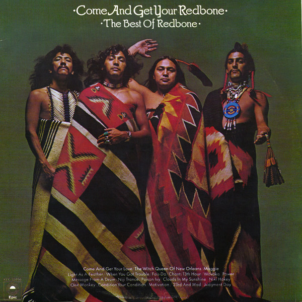

# Come And Get Your Redbone / The Best Of Redbone

By Redbone

## Album Data

[Discogs URL](https://www.discogs.com/release/3368513-Redbone-Come-And-Get-Your-Redbone-The-Best-Of-Redbone)

- Label: Epic
- Formats: Vinyl, LP, Compilation
- Genres: Rock, Funk / Soul, Blues Rock, Soul, Prog Rock
- Rating: 4.05
- Released: 1975
- Year: 1975
- Release ID: 3368513
- Media condition: 
- Sleeve condition: 
- Speed: 
- Weight: 
- Notes: 

## Album Tracks

| **Position** | **Title** | **Duration** |
|--------------|-----------|--------------|
| A1 | **Come And Get Your Love** | 4:57 |
| A2 | **Light As A Feather** | 1:56 |
| A3 | **When You Got Trouble** | 3:23 |
| A4 | **Fais-Do** | 2:35 |
| A5 | **Chant: 13th Hour** | 5:35 |
| B1 | **The Witch Queen Of New Orleans** | 2:44 |
| B2 | **Maggie** | 5:06 |
| B3 | **Wovoka** | 2:59 |
| B4 | **Message From A Drum** | 3:07 |
| B5 | **Niji Trance** | 3:26 |
| C1 | **Poison Ivy** | 3:02 |
| C2 | **Clouds In My Sunshine** | 4:44 |
| C3 | **One Monkey** | 4:08 |
| C4 | **Condition Your Condition** | 2:51 |
| C5 | **Motivation** | 2:23 |
| D1 | **23rd And Mad** | 6:48 |
| D2 | **Power (Prelude To A Means)** | 4:26 |
| D3 | **Judgement Day** | 2:36 |
| D4 | **Niki Hokey** | 3:16 |
| D5 | **Sweet Lady Of Love** | 3:02 |

## Artist Roles

| **Name** | **Role** |
|----------|----------|
| **Lee James (5)** | Liner Notes |
| **Alex Kazanegras** | Producer |
| **Lolly Vegas** | Producer |
| **Pat Vegas** | Producer |
| **Pete Welding** | Producer |

