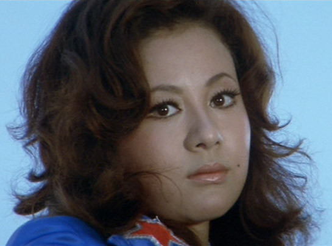

# Reiko Ike

## Artist Profile

Reiko Ike is a Japanese actress, singer, and entertainer. Born May 25, 1953 in Tokyo. She made her film debut in 1971 and released two singles and an album in the early '70s.

## Artist Links

- [https://en.wikipedia.org/wiki/Reiko_Ike](https://en.wikipedia.org/wiki/Reiko_Ike)

## See also

- [You, Baby [恍惚の世界]](You__Baby_[恍惚の世界].md)
