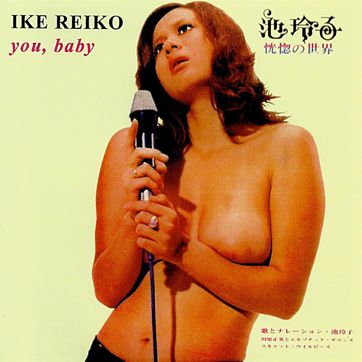

# You, Baby [恍惚の世界]

By Reiko Ike

## Album Data

[Discogs URL](https://www.discogs.com/release/10174394-Ike-Reiko-You-Baby-%E6%81%8D%E6%83%9A%E3%81%AE%E4%B8%96%E7%95%8C)

- Label: Bamboo (2)
Bamboo (2)
- Formats: Vinyl
CD, LP, Album, Limited Edition, Numbered, Reissue, Unofficial Release, Album
- Genres: Pop, Kayōkyoku
- Rating: 4.6
- Released: 2017
- Year: 1971
- Release ID: 10174394
- Media condition: 
- Sleeve condition: 
- Speed: 
- Weight: 
- Notes: 

## Album Tracks

| **Position** | **Title** | **Duration** |
|--------------|-----------|--------------|
|  | **LP** |  |
| A1 | **女はそれをがまんできない** |  |
| A2 | **よこはま たそがれ** |  |
| A3 | **めまい** |  |
| A4 | **雨がやんだら** |  |
| A5 | **夜明けのスキャット** |  |
| A6 | **さすらいのギター** |  |
| B1 | **私という女** |  |
| B2 | **雨の日のブルース** |  |
| B3 | **恋の奴隷** |  |
| B4 | **経験** |  |
| B5 | **天使になれない** |  |
| B6 | **愛のきずな** |  |
|  | **CD** |  |
| 1 | **The Woman Cannot Help It** | 3:19 |
| 2 | **It Is This Twilight** | 2:45 |
| 3 | **Vertigo** | 2:35 |
| 4 | **It Stops The Rain** | 3:02 |
| 5 | **Dawn Scat** | 3:02 |
| 6 | **Wandering Guitar** | 2:39 |
| 7 | **I'm A Woman Named** | 3:08 |
| 8 | **Rainy Day Blues** | 2:38 |
| 9 | **Love Slave** | 2:54 |
| 10 | **Experience** | 2:43 |
| 11 | **Angel** | 2:47 |
| 12 | **Chords Of Love** | 3:20 |

