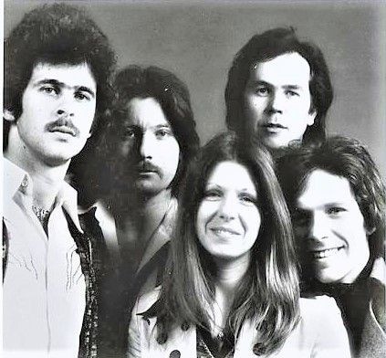

# Renaissance

## Artist Profile

Renaissance was originally formed in London, UK, in 1969 by ex-Yardbirds vocalist Keith Relf and drummer Jim McCarty who wanted to explore a new sound blending elements of rock, folk and classical music. Relf assumed the role of guitarist, and they were joined by bassist Louis Cennamo, keyboardist John Hawken, and vocalist Jane Relf. This lineup recorded the first self-titled album and most of the second album, Illusion (1971). A rapid series of personnel changes followed. Guitarist and composer Michael Dunford first appeared on Illusion. Before his departure from the band Hawken recruited new vocalist Annie Haslam. By 1972, when the Renaissance recorded their third album, Prologue, none of the original members remained though McCarty still wrote music for the band.

By 1973 the lineup had stabilized with Haslam, Dunford, keyboardist John Tout, bassist and vocalist Jon Camp, and drummer Terry Sullivan. This lineup produced a string of relatively successful albums over the remainder of the decade. They had one Top 10 single in the U.K., "Northern Lights", from the album A Song For All Seasons (1978).

By 1980 Sullivan and Tout departed leaving Haslam, Dunford, and Camp as the stable core of the group with various other musicians coming and going through the early and mid 1980s. The group released two albums, Camera Camera (1981) and Time-Line (1983) which were not well received by either fans or critics. Renaissance went into the studio to record a further album but found themselves without a label willing to release it. Material for this album as well as discarded tracks from the sessions for the previous three releases finally saw the light of day as Songs From Renaissance Days in 1997. 

Renaissance broke up in 1987 but both Michael Dunford and Annie Haslam tried to revive the name with different musicians in the 1990s. Haslam, Dunford, Tout, and Sullivan did reunite and released a studio album, Tuscany, in 2001, and a live album, In The Land Of The Rising Sun, in 2002. In 2009 Haslam and Dunford reformed Renaissance for a 40th anniversary concert tour. Rave Tesar, who replaced John Tout on keyboards for the 2001-02 tour and David J. Keyes, the bassist from the same tour, also rejoined the band. Two new members were also added to the lineup, keyboardist Tom Brislin and drummer Frank Pagano.

Live CDs and DVDs from their 2011 tour were released, with Jason Hart replacing Tom Brislin on keyboards. In 2013 their first new studio album in 12 years, Grandine Il Vento was released. It was the last album to feature Michael Dunford, who died in November, 2012.

## Artist Links

- [https://renaissancetouring.com/](https://renaissancetouring.com/)
- [http://www.nlightsweb.com/](http://www.nlightsweb.com/)
- [http://www.progarchives.com/artist.asp?id=603](http://www.progarchives.com/artist.asp?id=603)
- [http://www.johnhawken.com/renaissance.html](http://www.johnhawken.com/renaissance.html)
- [http://en.wikipedia.org/wiki/Renaissance_%28band%29](http://en.wikipedia.org/wiki/Renaissance_%28band%29)
- [http://myspace.com/renaissanceofficial](http://myspace.com/renaissanceofficial)
- [http://renaissance-fanfare.net/](http://renaissance-fanfare.net/)
- [https://www.last.fm/music/Renaissance/+wiki](https://www.last.fm/music/Renaissance/+wiki)
- [https://dariuschrisgoes.blogspot.com/2015/05/101-mb-bitrate-256-mp3-ripped-by.html](https://dariuschrisgoes.blogspot.com/2015/05/101-mb-bitrate-256-mp3-ripped-by.html)

## See also

- [Scheherazade And Other Stories](Scheherazade_And_Other_Stories.md)
