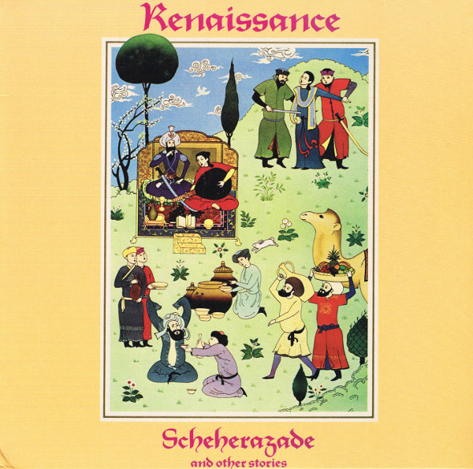

# Scheherazade And Other Stories

By Renaissance

## Album Data

[Discogs URL](https://www.discogs.com/release/7825569-Renaissance-Scheherazade-And-Other-Stories)

- Label: Repertoire Records
Repertoire Records
- Formats: Vinyl, LP, Album, Reissue, Remastered, Stereo
- Genres: Rock, Art Rock, Prog Rock, Symphonic Rock
- Rating: 4.63
- Released: 2015-11-13
- Year: 1975
- Release ID: 7825569
- Media condition: 
- Sleeve condition: 
- Speed: 
- Weight: 
- Notes: 

## Album Tracks

| **Position** | **Title** | **Duration** |
|--------------|-----------|--------------|
| A1 | **Trip To The Fair** | 10:48 |
| A2 | **The Vultures Fly High** | 3:02 |
| A3 | **Ocean Gypsy** | 7:04 |
|  | **Song Of Scheherazade** | 24:39 |

## Artist Roles

| **Name** | **Role** |
|----------|----------|
| **Michael Dunford** | Acoustic Guitar, Vocals |
| **Renaissance (4)** | Arranged By [Musical Arrangements] |
| **Tony Cox** | Arranged By [Orchestral Arrangements] |
| **Jon Camp** | Bass, Pedalboard [Bass Pedals], Vocals |
| **Betty Thatcher** | Composed By |
| **Michael Dunford** | Composed By |
| **David Hitchcock** | Coordinator [Co-ordination] |
| **Hipgnosis (2)** | Cover, Design, Photography By |
| **Terry Sullivan** | Drums, Percussion, Vocals |
| **Pat Stapley** | Engineer [Assistant, Recording] |
| **Annie Plant** | Engineer [Assistant, Remixing] |
| **Mike Pela** | Engineer [Assistant, Remixing] |
| **John Kurlander** | Engineer [Recording] |
| **Dick Plant** | Engineer [Remixing] |
| **Colin Elgie** | Illustration |
| **John Tout** | Keyboards, Vocals |
| **Daniel Krieger** | Lacquer Cut By |
| **Annie Haslam** | Lead Vocals |
| **Renaissance (4)** | Producer |

