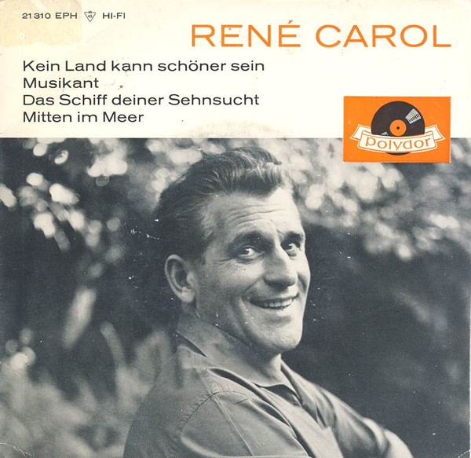

# Kein Land Kann Schöner Sein

By René Carol

## Album Data

[Discogs URL](https://www.discogs.com/release/7891688-Ren%C3%A9-Carol-Kein-Land-Kann-Sch%C3%B6ner-Sein)

- Label: Polydor
- Formats: Vinyl, 7", 45 RPM, EP
- Genres: Pop, Folk, World, & Country
- Rating: 0
- Released: 1961
- Year: 1961
- Release ID: 7891688
- Media condition: 
- Sleeve condition: 
- Speed: 
- Weight: 
- Notes: 

## Album Tracks

| **Position** | **Title** | **Duration** |
|--------------|-----------|--------------|
| A1 | **Kein Land Kann Schöner Sein** |  |
| A2 | **Musikant** |  |
| B1 | **Das Schiff Deiner Sehnsucht** |  |
| B2 | **Mitten Im Meer** |  |

