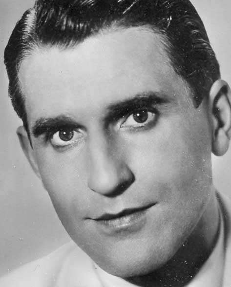

# René Carol

## Artist Profile

German Schlager singer. Born 11 April 1920 in Berlin, Germany and died 9 April 1978 in Minden, Germany.

## Artist Links

## See also

- [Kein Land Kann Schöner Sein](Kein_Land_Kann_Schöner_Sein.md)
