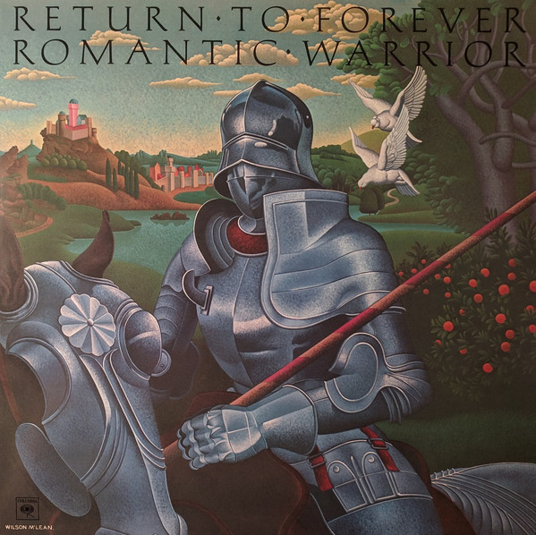

# Romantic Warrior

By Return To Forever

## Album Data

[Discogs URL](https://www.discogs.com/release/4572321-Return-To-Forever-Romantic-Warrior)

- Label: Music On Vinyl
- Formats: Vinyl, LP, Album, Reissue
- Genres: Jazz, Rock, Fusion, Jazz-Rock
- Rating: 4.61
- Released: 2011
- Year: 1976
- Release ID: 4572321
- Media condition: 
- Sleeve condition: 
- Speed: 
- Weight: 
- Notes: 

## Album Tracks

| **Position** | **Title** | **Duration** |
|--------------|-----------|--------------|
| A1 | **Medieval Overture** | 5:14 |
| A2 | **Sorceress** | 7:33 |
| A3 | **The Romantic Warrior** | 10:48 |
| B1 | **Majestic Dance** | 5:00 |
| B2 | **The Magician** | 5:27 |
| B3 | **Duel Of The Jester And The Tyrant (Part I & Part II)** | 11:25 |

## Artist Roles

| **Name** | **Role** |
|----------|----------|
| **John Berg** | Design |
| **Lenny White** | Drums, Timpani, Congas, Timbales, Handbell [Hand Bells], Snare [Snare Drum], Cymbal [Suspended Cymbals], Performer [Alarm Clock] |
| **Stanley Clarke** | Electric Bass [Alembic Bass With Instant Flanger], Bass [Piccolo Bass], Double Bass [Acoustic Bass], Bell Tree, Handbell [Hand Bells] |
| **Al Di Meola** | Electric Guitar, Acoustic Guitar, Guitar [Soprano], Handbell [Hand Bells], Slide Whistle |
| **Tom Likes** | Engineer [Assistant Engineer] |
| **Dennis Mackay** | Engineer [Recording], Engineer [Remix] |
| **Theta Management** | Management |
| **Wilson McLean** | Painting [Cover Painting] |
| **Don Hunstein** | Photography By [Back Cover] |
| **Chick Corea** | Piano [Acoustic], Electric Piano [Fender Rhodes], Clavinet [Honer], Synthesizer [Mini Moog, Moog 15, Micro Mini Moog, Arp Odyssey, Yamaha Organ, Polymoog], Marimba, Percussion |
| **Chick Corea** | Producer |
| **Al Di Meola** | Producer [Assistant] |
| **Lenny White** | Producer [Assistant] |
| **Stanley Clarke** | Producer [Assistant] |
| **Gerard Huerta** | Typography [Logo] |

