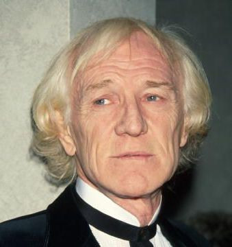

# Richard Harris

## Artist Profile

Irish singer and actor who played Marcus Aurelius in Gladiator and Albus Dumbledore in the Harry Potter movies, born 1 October 1930 in Limerick, Ireland and died 25 October 2002 in London, England, UK. Father of Jared Harris.

## Artist Links

- [https://en.wikipedia.org/wiki/Richard_Harris](https://en.wikipedia.org/wiki/Richard_Harris)
- [https://www.imdb.com/name/nm0001321/](https://www.imdb.com/name/nm0001321/)

## See also

- [A Tramp Shining](A_Tramp_Shining.md)
