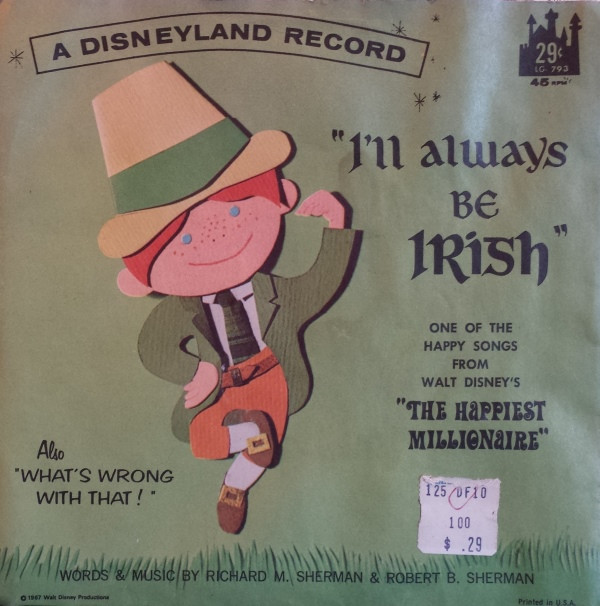

# I'll Always Be Irish

By Richard M. Sherman

## Album Data

[Discogs URL](https://www.discogs.com/release/4968510-Richard-M-Sherman-And-Bill-Lee-Ill-Always-Be-Irish)

- Label: Disneyland
- Formats: Vinyl, 7", 45 RPM
- Genres: Pop, Children's, Stage & Screen, Vocal
- Rating: 0
- Released: 1967
- Year: 1967
- Release ID: 4968510
- Media condition: 
- Sleeve condition: 
- Speed: 
- Weight: 
- Notes: 

## Album Tracks

| **Position** | **Title** | **Duration** |
|--------------|-----------|--------------|
| A | **I'll Always Be Irish** |  |
| B | **What's Wrong With That** |  |

## Artist Roles

| **Name** | **Role** |
|----------|----------|
| **Richard M. Sherman** | Written-By, Music By |
| **Robert B. Sherman** | Written-By, Music By |

