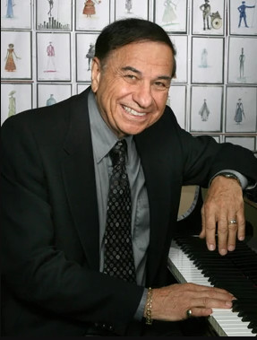

# Richard M. Sherman

## Artist Profile

Songwriter, born 12 June 1928 in New York, New York. 

Since the 1950s Sherman forms a songwriting team with his brother Robert B. Sherman. Often working for the Walt Disney film studios, they composed the songs for movies like Mary Poppins, The Jungle Book and Chitty Chitty Bang Bang. 

During his career that spans almost 50 years, he has won multiple Academy and Grammy Awards and was inducted into the Songwriters Hall of Fame in 2005. 

The Sherman brothers are the sons of Al Sherman (2).

## Artist Links

- [http://www.songwritershalloffame.org/exhibits/C347](http://www.songwritershalloffame.org/exhibits/C347)
- [http://legends.disney.go.com/legends/detail?key=Richard+Sherman](http://legends.disney.go.com/legends/detail?key=Richard+Sherman)
- [http://www.allmusic.com/artist/richard-m-sherman-mn0000351536](http://www.allmusic.com/artist/richard-m-sherman-mn0000351536)
- [https://en.wikipedia.org/wiki/Richard_M._Sherman](https://en.wikipedia.org/wiki/Richard_M._Sherman)
- [https://www.imdb.com/name/nm0792556/?ref_=nv_sr_srsg_0](https://www.imdb.com/name/nm0792556/?ref_=nv_sr_srsg_0)
- [https://it.wikipedia.org/wiki/Richard_M._Sherman](https://it.wikipedia.org/wiki/Richard_M._Sherman)

## See also

- [I'll Always Be Irish](Ill_Always_Be_Irish.md)
