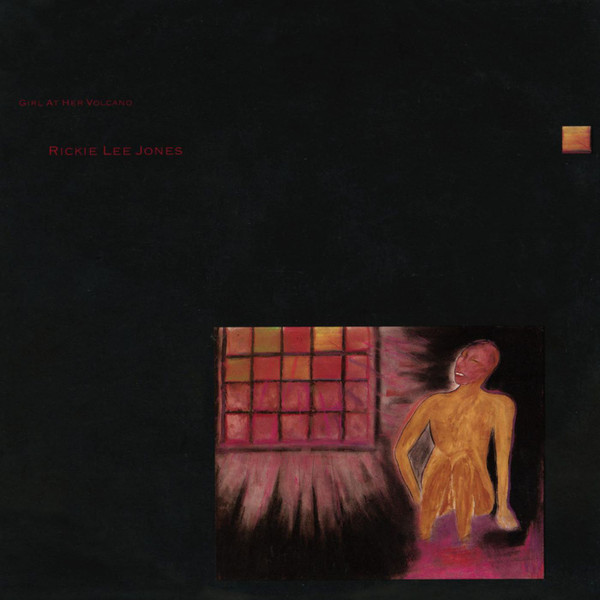

# Girl At Her Volcano

By Rickie Lee Jones

## Album Data

[Discogs URL](https://www.discogs.com/release/754225-Rickie-Lee-Jones-Girl-At-Her-Volcano)

- Label: Warner Bros. Records
Warner Bros. Records
- Formats: Vinyl, 10", 33 ⅓ RPM, EP
- Genres: Jazz, Rock, Pop, Vocal, Pop Rock
- Rating: 3.85
- Released: 1983
- Year: 1983
- Release ID: 754225
- Media condition: 
- Sleeve condition: 
- Speed: 
- Weight: 
- Notes: 

## Album Tracks

| **Position** | **Title** | **Duration** |
|--------------|-----------|--------------|
| A1 | **Lush Life** | 5:26 |
| A2 | **Letters From The 9th Ward / Walk Away Rene** | 4:27 |
| A3 | **Hey, Bub** | 2:17 |
| A4 | **My Funny Valentine** | 1:29 |
| B1 | **Under The Boardwalk** | 3:20 |
| B2 | **Rainbow Sleeves** | 3:40 |
| B3 | **So Long** | 2:04 |

## Artist Roles

| **Name** | **Role** |
|----------|----------|
| **Nathan East** | Bass |
| **Eddie Karam** | Conductor [Horns & Strings] |
| **Jeri McManus** | Design [Album Design] |
| **Rickie Lee Jones** | Design [Album Design] |
| **Art Rodriguez** | Drums |
| **Michael Ruff (2)** | Electric Piano [Fender Rhodes] |
| **Ken Tracht** | Engineer [2nd Engineer] |
| **Margaret Gwynne** | Engineer [2nd Engineer] |
| **Mark Linett** | Engineer, Mixed By, Producer [Production Assistant] |
| **Dean Parks** | Guitar |
| **Bobby Hata** | Mastered By [Digitally Mastered By] |
| **Earl Dannar** | Oboe |
| **Craig Dietz** | Photography By [Back Cover] |
| **Rickie Lee Jones** | Piano, Producer, Vocals, Illustration [Cover Drawing] |
| **Annie Streer** | Producer [Production Assistant] |
| **JoAnn Tominaga** | Producer [Production Assistant] |
| **Karen Appere** | Producer [Production Assistant] |
| **Liz Rosenberg** | Producer [Production Assistant] |
| **Steve Baker (3)** | Producer [Production Assistant] |
| **Larry Williams** | Saxophone |
| **Chuck Findley** | Trumpet |

