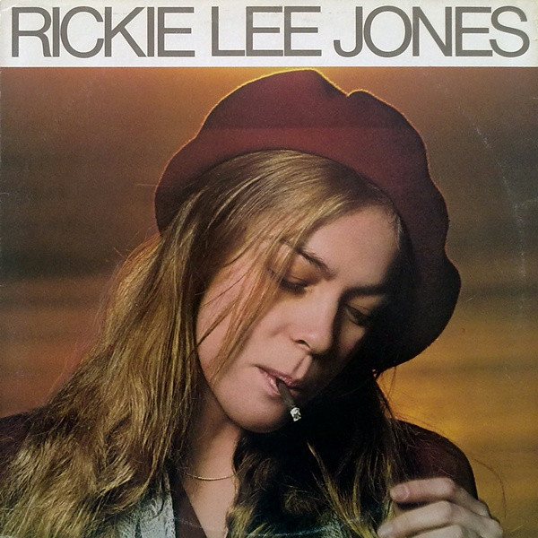

# Rickie Lee Jones

By Rickie Lee Jones

## Album Data

[Discogs URL](https://www.discogs.com/release/1305473-Rickie-Lee-Jones-Rickie-Lee-Jones)

- Label: Warner Bros. Records
- Formats: Vinyl, LP, Album, Stereo
- Genres: Rock, Funk / Soul, Rhythm & Blues
- Rating: 3.87
- Released: 1979-03-23
- Year: 1979
- Release ID: 1305473
- Media condition: 
- Sleeve condition: 
- Speed: 
- Weight: 
- Notes: 

## Album Tracks

| **Position** | **Title** | **Duration** |
|--------------|-----------|--------------|
| A1 | **Chuck E.'s In Love** | 3:31 |
| A2 | **On Saturday Afternoons In 1963** | 2:35 |
| A3 | **Night Train** | 3:18 |
| A4 | **Young Blood** | 4:07 |
| A5 | **Easy Money** | 3:20 |
| A6 | **The Last Chance Texaco** | 4:08 |
| B1 | **Danny's All-Star Joint** | 4:06 |
| B2 | **Coolsville** | 3:52 |
| B3 | **Weasel And The White Boys Cool** | 6:03 |
| B4 | **Company** | 4:54 |
| B5 | **After Hours (Twelve Bars Past Goodnight)** | 2:15 |

## Artist Roles

| **Name** | **Role** |
|----------|----------|
| **Nick DeCaro** | Accordion |
| **Rickie Lee Jones** | Arranged By [Horns] |
| **Mike Salisbury** | Art Direction, Design [Cover] |
| **Arno Lucas** | Backing Vocals |
| **Joe Turano** | Backing Vocals |
| **Leslie Smith** | Backing Vocals |
| **Matthew Weiner** | Backing Vocals |
| **Michael McDonald** | Backing Vocals |
| **Rickie Lee Jones** | Backing Vocals |
| **Red Callender** | Bass |
| **Willie Weeks** | Bass [Fender] |
| **Andy Newmark** | Drums |
| **Jeff Porcaro** | Drums |
| **Mark Stevens (2)** | Drums |
| **Steve Gadd** | Drums |
| **Victor Feldman** | Drums |
| **Lee Herschberg** | Engineer |
| **Loyd Clifft** | Engineer |
| **Roger Nichols** | Engineer [Additional Engineering] |
| **Tom Knox** | Engineer [Additional Engineering] |
| **Buzzy Feiten** | Guitar |
| **Fred Tackett** | Guitar |
| **Rickie Lee Jones** | Guitar |
| **Chuck Findley** | Horns |
| **Ernie Watts** | Horns |
| **Tom Scott** | Horns |
| **Mac Rebennack** | Keyboards |
| **Neil Larsen** | Keyboards |
| **Ralph Grierson** | Keyboards |
| **Randy Kerber** | Keyboards |
| **Rickie Lee Jones** | Keyboards |
| **Victor Feldman** | Keyboards |
| **Fred Tackett** | Mandolin |
| **Lee Herschberg** | Mixed By, Mastered By |
| **Mark Stevens (2)** | Percussion |
| **Rickie Lee Jones** | Percussion |
| **Victor Feldman** | Percussion |
| **Norman Seeff** | Photography By [Cover] |
| **Lenny Waronker** | Producer |
| **Russ Titelman** | Producer |
| **Penny Ringwood** | Producer [Production Assistant] |
| **Michael Boddicker** | Synthesizer |
| **Randy Newman** | Synthesizer |
| **Rickie Lee Jones** | Written-By |

