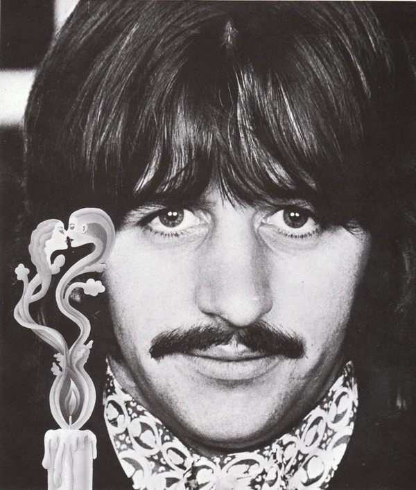

# Ringo Starr

## Artist Profile

Ringo Starr is the pseudonym of Sir Richard Starkey, MBE (born 7 July 1940 in Liverpool, England, UK) a British musician, singer, songwriter, and occasional actor. He was the drummer for The Beatles. 
Since 1989 Ringo has toured and recorded live albums with the Ringo Starr And His All-Starr Band.

## Artist Links

- [https://www.ringostarr.com/](https://www.ringostarr.com/)
- [https://en.wikipedia.org/wiki/Ringo_Starr](https://en.wikipedia.org/wiki/Ringo_Starr)

## See also

- [Photograph](Photograph.md)
