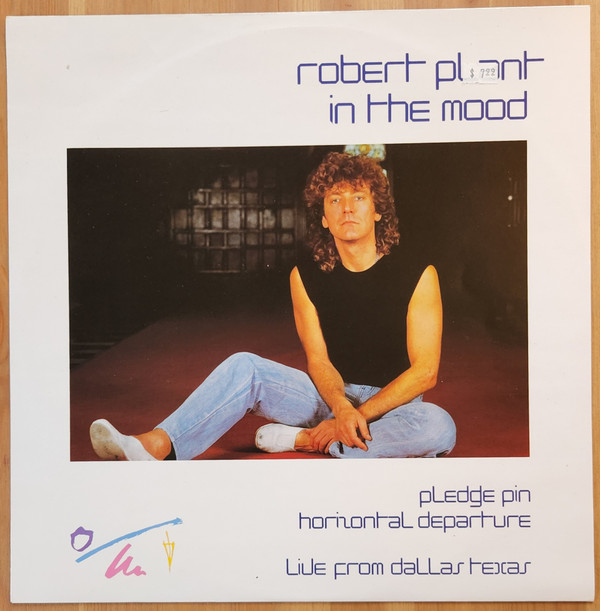

# In The Mood

By Robert Plant

## Album Data

[Discogs URL](https://www.discogs.com/release/3597449-Robert-Plant-In-The-Mood)

- Label: Es Paranza Records
- Formats: Vinyl, 7", 45 RPM
- Genres: Rock, Classic Rock
- Rating: 3.67
- Released: 1983
- Year: 1983
- Release ID: 3597449
- Media condition: 
- Sleeve condition: 
- Speed: 
- Weight: 
- Notes: 

## Album Tracks

| **Position** | **Title** | **Duration** |
|--------------|-----------|--------------|
| A | **In The Mood** | 5:19 |
| B | **Horizontal Departure** | 4:19 |

