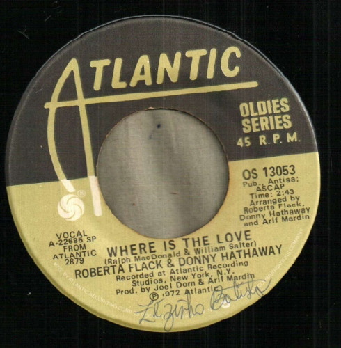

# Where Is The Love / You've Got A Friend

By Roberta Flack

## Album Data

[Discogs URL](https://www.discogs.com/release/2963776-Roberta-Flack-Donny-Hathaway-Where-Is-The-Love-Youve-Got-A-Friend)

- Label: Atlantic
- Formats: Vinyl, 7", Single, Reissue, 45 RPM
- Genres: Funk / Soul, Soul
- Rating: 4.33
- Released: null
- Year: 0
- Release ID: 2963776
- Media condition: 
- Sleeve condition: 
- Speed: 
- Weight: 
- Notes: 

## Album Tracks

| **Position** | **Title** | **Duration** |
|--------------|-----------|--------------|
| A | **Where Is The Love** | 2:43 |
| B | **You've Got A Friend** | 3:20 |

