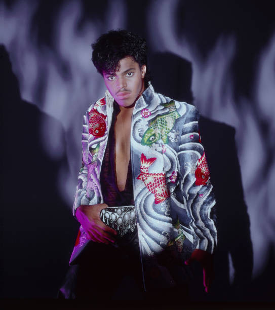

# Rockwell

## Artist Profile

Born March 15, 1964, Detroit as son of Berry Gordy, creator of the Motown label.
American vocalist and producer who had a brief career in the mid-1980s, mostly following the success of his hit single "Somebody's Watching Me" (1983). 

His father named him Kennedy William after John F. Kennedy and William "Smokey" Robinson.
His paternal half-sister is actress Rhonda Ross Kendrick, the eldest child of Diana Ross.

## Artist Links

- [http://en.wikipedia.org/wiki/Rockwell_(musician)](http://en.wikipedia.org/wiki/Rockwell_(musician))
- [https://www.facebook.com/RockwellFanPage](https://www.facebook.com/RockwellFanPage)

## See also

- [Somebody's Watching Me](Somebodys_Watching_Me.md)
