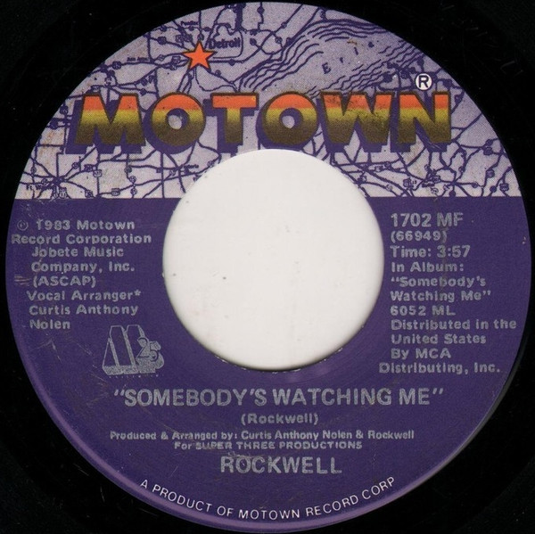

# Somebody's Watching Me

By Rockwell

## Album Data

[Discogs URL](https://www.discogs.com/release/1831469-Rockwell-Somebodys-Watching-Me)

- Label: Motown
- Formats: Vinyl, 7", 45 RPM, Single
- Genres: Electronic, Synth-pop, Disco
- Rating: 4.31
- Released: 1983
- Year: 1983
- Release ID: 1831469
- Media condition: 
- Sleeve condition: 
- Speed: 
- Weight: 
- Notes: 

## Album Tracks

| **Position** | **Title** | **Duration** |
|--------------|-----------|--------------|
| A | **Somebody's Watching Me** | 3:57 |
| B | **Somebody's Watching Me (Instrumental)** | 3:57 |

## Artist Roles

| **Name** | **Role** |
|----------|----------|
| **John Matousek** | Mastered By |
| **Curtis Anthony Nolen** | Producer [Produced By], Arranged By |
| **Rockwell** | Producer [Produced By], Arranged By |
| **Rockwell** | Written-By |

