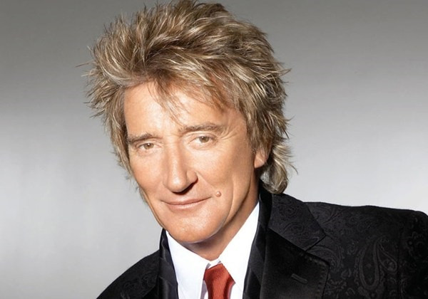

# Rod Stewart

## Artist Profile

British singer, born January 10, 1945 in London, England. In addition to his successful solo career, he has also been a member of successful high-profile rock groups the Jeff Beck Group and the Faces.

Inducted into Rock and Roll Hall of Fame in 1994 as a solo artist, and again in 2012 as a member of the Faces (both as a Performer).

Previously worked as a gravedigger at Highgate Cemetery in London & at a funeral parlour in North Finchley.

## Artist Links

- [https://www.rodstewart.com/](https://www.rodstewart.com/)
- [https://twitter.com/rodstewart](https://twitter.com/rodstewart)
- [https://www.facebook.com/rodstewart](https://www.facebook.com/rodstewart)
- [https://www.youtube.com/user/RodStewart](https://www.youtube.com/user/RodStewart)
- [https://myspace.com/rodstewart](https://myspace.com/rodstewart)
- [https://www.last.fm/music/Rod+Stewart](https://www.last.fm/music/Rod+Stewart)
- [https://en.wikipedia.org/wiki/Rod_Stewart](https://en.wikipedia.org/wiki/Rod_Stewart)
- [https://www.imdb.com/name/nm0005465/](https://www.imdb.com/name/nm0005465/)
- [https://www.youtube.com/channel/UCE5MST8NSGuWr88dQcNZ0fw](https://www.youtube.com/channel/UCE5MST8NSGuWr88dQcNZ0fw)

## See also

- [Every Picture Tells A Story](Every_Picture_Tells_A_Story.md)
- [Gasoline Alley](Gasoline_Alley.md)
