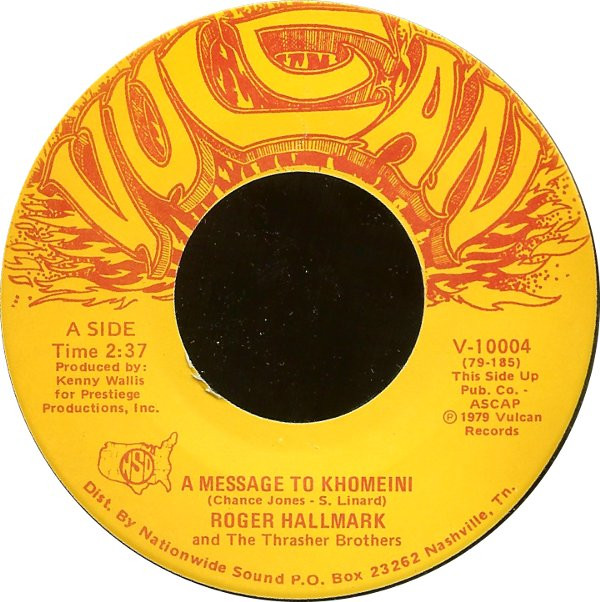

# A Message To Khomeini

By Roger Hallmark

## Album Data

[Discogs URL](https://www.discogs.com/release/2344239-Roger-Hallmark-And-The-Thrasher-Brothers-A-Message-To-Khomeini)

- Label: Vulcan (4)
- Formats: Vinyl, 7", 45 RPM
- Genres: Pop, Folk, World, & Country, Country, Novelty
- Rating: 2.5
- Released: 1979
- Year: 1979
- Release ID: 2344239
- Media condition: 
- Sleeve condition: 
- Speed: 
- Weight: 
- Notes: 

## Album Tracks

| **Position** | **Title** | **Duration** |
|--------------|-----------|--------------|
| A | **A Message To Khomeini** | 2:37 |
| B | **Maharishi** | 3:03 |

## Artist Roles

| **Name** | **Role** |
|----------|----------|
| **Kenny Wallis** | Producer |
| **Chance Jones** | Written-By |
| **Signa Faye Linard** | Written-By |

