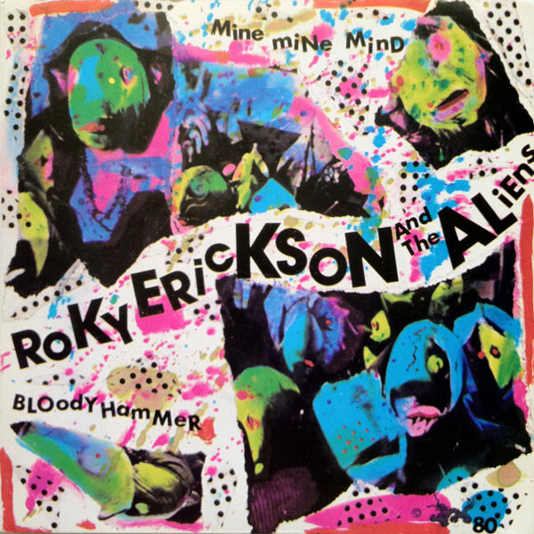

# Mine Mine Mind / Bloody Hammer

By Roky Erickson And The Aliens

## Album Data

[Discogs URL](https://www.discogs.com/release/1218033-Roky-Erickson-And-The-Aliens-Mine-Mine-Mind-Bloody-Hammer)

- Label: CBS
- Formats: Vinyl, 7", 45 RPM, Single
- Genres: Rock, Psychedelic Rock
- Rating: 4.42
- Released: 1980-10-10
- Year: 1980
- Release ID: 1218033
- Media condition: 
- Sleeve condition: 
- Speed: 
- Weight: 
- Notes: 

## Album Tracks

| **Position** | **Title** | **Duration** |
|--------------|-----------|--------------|
| A | **Mine Mine Mind** | 2:34 |
| B | **Bloody Hammer** | 5:03 |

## Artist Roles

| **Name** | **Role** |
|----------|----------|
| **Stu Cook** | Producer |
| **Roky Erickson** | Written-By, Vocals [Uncredited] |

