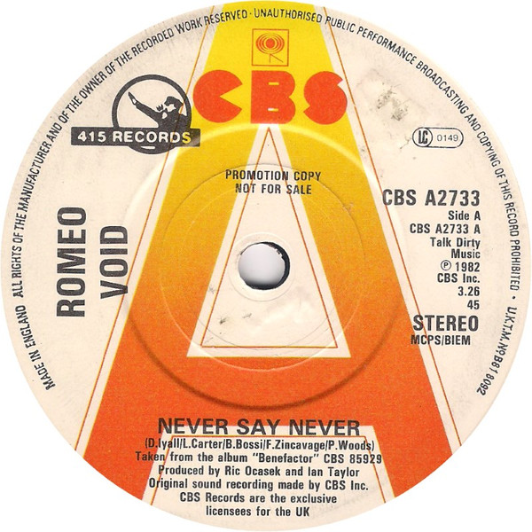

# Never Say Never

By Romeo Void

## Album Data

[Discogs URL](https://www.discogs.com/release/379831-Romeo-Void-Never-Say-Never)

- Label: Columbia
415 Records
- Formats: Vinyl, 12", 33 ⅓ RPM, Stereo
- Genres: Rock, New Wave
- Rating: 4.36
- Released: 1981
- Year: 1981
- Release ID: 379831
- Media condition: 
- Sleeve condition: 
- Speed: 
- Weight: 
- Notes: 

## Album Tracks

| **Position** | **Title** | **Duration** |
|--------------|-----------|--------------|
| A1 | **Never Say Never** | 6:05 |
| A2 | **In The Dark** | 4:24 |
| B1 | **Present Tense** | 5:47 |
| B2 | **Not Safe** | 3:52 |

## Artist Roles

| **Name** | **Role** |
|----------|----------|
| **Frank Zincavage** | Bass, Design |
| **Peter Soe, Jr.** | Design |
| **Larry Carter** | Drums |
| **Walter Turbitt** | Engineer [Assistant Engineer] |
| **Peter Woods (2)** | Guitar |
| **Romeo Void** | Lyrics By [Words By], Music By |
| **Ric Ocasek** | Producer [Produced By] |
| **Ian Taylor** | Producer [Produced By], Engineer [Engineered By] |
| **Benjamin Bossi** | Saxophone |
| **Debora Iyall** | Vocals |

