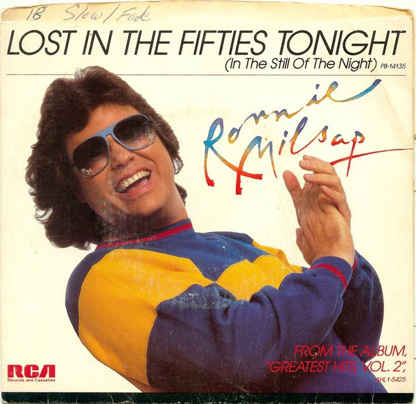

# Lost In The Fifties Tonight (In The Still Of The Night)

By Ronnie Milsap

## Album Data

[Discogs URL](https://www.discogs.com/release/3102213-Ronnie-Milsap-Lost-In-The-Fifties-Tonight-In-The-Still-Of-The-Night)

- Label: RCA
- Formats: Vinyl, 7", 45 RPM, Styrene, Stereo
- Genres: Rock, Folk, World, & Country, Country Rock
- Rating: 3.56
- Released: 1985
- Year: 1985
- Release ID: 3102213
- Media condition: 
- Sleeve condition: 
- Speed: 
- Weight: 
- Notes: 

## Album Tracks

| **Position** | **Title** | **Duration** |
|--------------|-----------|--------------|
| A | **Lost In The Fifties Tonight (In The Still Of The Night)** | 3:51 |
| B | **I Might Have Said** | 4:08 |

## Artist Roles

| **Name** | **Role** |
|----------|----------|
| **Rob Galbraith** | Producer [Produced By] |
| **Ronnie Milsap** | Producer [Produced By] |

