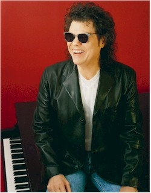

# Ronnie Milsap

## Artist Profile

American country- and pop singer, born January 16, 1944 in 
Robbinsville, North Carolina.

## Artist Links

- [http://www.ronniemilsap.com/](http://www.ronniemilsap.com/)
- [http://www.cmt.com/artists/az/milsap_ronnie/artist.jhtml](http://www.cmt.com/artists/az/milsap_ronnie/artist.jhtml)
- [https://en.wikipedia.org/wiki/Ronnie_Milsap](https://en.wikipedia.org/wiki/Ronnie_Milsap)

## See also

- [Lost In The Fifties Tonight (In The Still Of The Night)](Lost_In_The_Fifties_Tonight_In_The_Still_Of_The_Night.md)
- [Southern Roots](Southern_Roots.md)
