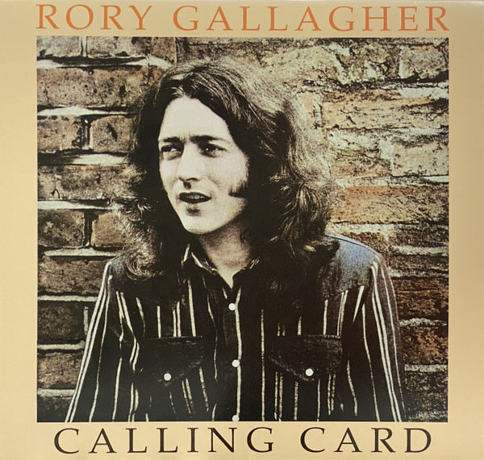

# Calling Card

By Rory Gallagher

## Album Data

[Discogs URL](https://www.discogs.com/release/4124942-Rory-Gallagher-Calling-Card)

- Label: Music On Vinyl
Capo (2)
Sony Music
Legacy
- Formats: Vinyl, LP, Album, Reissue, Remastered
- Genres: Rock, Blues, Blues Rock, Electric Blues
- Rating: 4.37
- Released: 2012-10-15
- Year: 1976
- Release ID: 4124942
- Media condition: 
- Sleeve condition: 
- Speed: 
- Weight: 
- Notes: 

## Album Tracks

| **Position** | **Title** | **Duration** |
|--------------|-----------|--------------|
| A1 | **Do You Read Me** |  |
| A2 | **Country Mile** |  |
| A3 | **Moonchild** |  |
| A4 | **Calling Card** |  |
| A5 | **I'll Admit You're Gone** |  |
| B1 | **Secret Agent** |  |
| B2 | **Jack-knife Beat** |  |
| B3 | **Edged In Blue** |  |
| B4 | **Barley & Grape Rag** |  |

## Artist Roles

| **Name** | **Role** |
|----------|----------|
| **Mark Jessett Design** | Art Direction |
| **Gerry McAvoy** | Bass |
| **Rod De'Ath** | Drums, Percussion |
| **Dónal Gallagher** | Executive-Producer |
| **Lou Martin** | Keyboards |
| **Michael Putland** | Photography By |
| **Roger Glover** | Producer |
| **Rory Gallagher** | Producer |
| **Andy Pearce** | Remastered By |
| **Matt Wortham** | Remastered By |
| **Rory Gallagher** | Vocals, Guitar, Harmonica |

