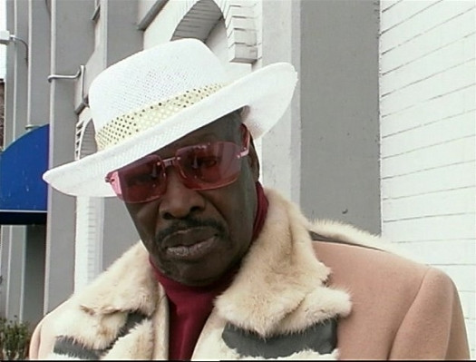

# Rudy Ray Moore

## Artist Profile

Born: March 17th, 1927 Fort Smith, Arkansas.
Died: October 19th, 2008 Akron, Ohio.

An American entertainer, actor, director and musician. He was most famous for his Dolemite character and Blaxploitation era movies.
In the late 50s Moore was the assistant to John Dolphin and shop manager of the famous Dolphins Of Hollywood store in Los Angeles.

## Artist Links

- [https://www.rudyraymoore.com/](https://www.rudyraymoore.com/)
- [https://en.wikipedia.org/wiki/Rudy_Ray_Moore](https://en.wikipedia.org/wiki/Rudy_Ray_Moore)
- [https://www.imdb.com/name/nm0601834/](https://www.imdb.com/name/nm0601834/)
- [http://wdd.mbnet.fi/rudyraymoore.htm](http://wdd.mbnet.fi/rudyraymoore.htm)

## See also

- [The Second Rudy Ray Moore Album (This Pussy Belongs To Me)](The_Second_Rudy_Ray_Moore_Album_This_Pussy_Belongs_To_Me.md)
