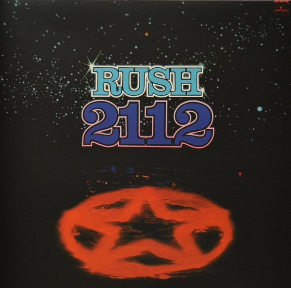

# 2112

By Rush

## Album Data

[Discogs URL](https://www.discogs.com/release/6784053-Rush-2112)

- Label: Mercury
Anthem (5)
UMe
- Formats: Vinyl, LP, Album, Etched, Reissue, Remastered
- Genres: Rock, Prog Rock
- Rating: 4.73
- Released: 2015-03-17
- Year: 1976
- Release ID: 6784053
- Media condition: 
- Sleeve condition: 
- Speed: 
- Weight: 
- Notes: 

## Album Tracks

| **Position** | **Title** | **Duration** |
|--------------|-----------|--------------|
|  | **2112** | 20:36 |
| B1 | **A Passage To Bangkok** | 3:30 |
| B2 | **The Twilight Zone** | 3:14 |
| B3 | **Lessons** | 3:40 |
| B4 | **Tears** | 3:29 |
| B5 | **Something For Nothing** | 3:56 |

## Artist Roles

| **Name** | **Role** |
|----------|----------|
| **Jeff Fura** | A&R [UMe] |
| **Tristan Duke** | Artwork [Hand-Drawn Hologram] |
| **Geddy Lee** | Bass, Keyboards, Vocals |
| **Neil Peart** | Drums |
| **Terry Brown** | Engineer |
| **Alex Lifeson** | Guitar |
| **Ray Danniels** | Management |
| **SRO Management, Inc.** | Management |
| **Sean Magee** | Mastered By |
| **Rush** | Producer |
| **Terry Brown** | Producer |
| **Liuba Shapiro** | Product Manager [UMe] |
| **Michele Horie** | Production Manager [UMe] |
| **Andy Curran** | Supervised By [Artist Liaison For Remastering] |

