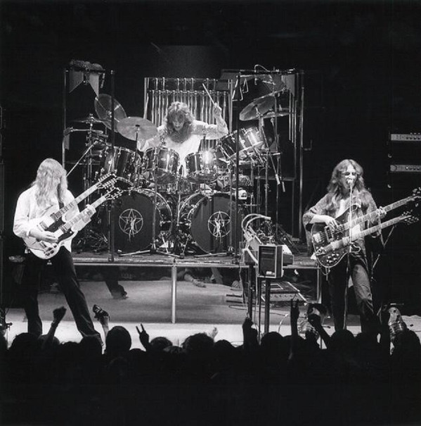

# Rush

## Artist Profile

Canadian heavy progressive rock trio, formed in 1968 in Toronto, Canada. Disbanded in 2018.

Rush retired from touring after the R40 tour when Neil Peart announced he would retire due to health reasons. In January 2018, Alex Lifeson said in an interview that Rush's career had come to an end. On January 7, 2020, after a three-year illness, Neil Ellwood Peart died of glioblastoma at age 67, his passing was officially announced on January 10, 2020.

## Artist Links

- [https://www.rush.com/](https://www.rush.com/)
- [https://www.facebook.com/rushtheband](https://www.facebook.com/rushtheband)
- [https://twitter.com/rushtheband](https://twitter.com/rushtheband)
- [https://www.youtube.com/rush](https://www.youtube.com/rush)
- [https://en.wikipedia.org/wiki/Rush_(band)](https://en.wikipedia.org/wiki/Rush_(band))

## See also

- [2112](2112.md)
