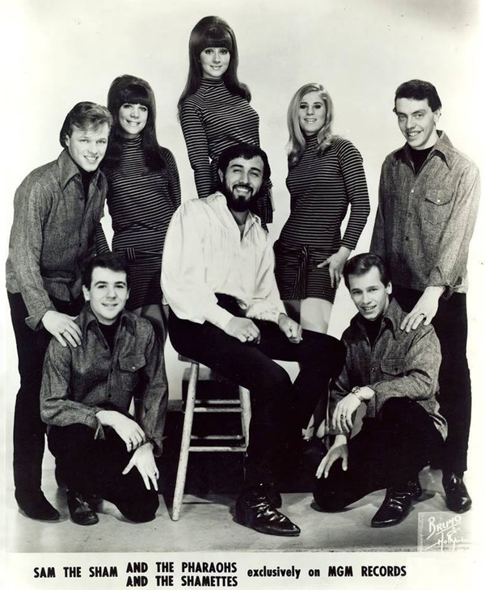

# Sam The Sham & The Pharaohs

## Artist Profile

American garage rock and rhythm & blues group from Dallas, Texas. Best remembered for their 1965 hit “Wooly Bully”. Disbanded in 1967. Performed with backing vocal group The Sham-Ettes. 

Domingo Samudio alias Sam The Sham alias Sam Samudio 

## Artist Links

- [http://www.billboard.com/artist/277982/sam-sham-pharaohs/biography](http://www.billboard.com/artist/277982/sam-sham-pharaohs/biography)
- [https://en.wikipedia.org/wiki/Sam_the_Sham](https://en.wikipedia.org/wiki/Sam_the_Sham)
- [https://www.imdb.com/name/nm1870655/](https://www.imdb.com/name/nm1870655/)
- [https://www.imdb.com/name/nm0760375/](https://www.imdb.com/name/nm0760375/)

## See also

- [Wooly Bully / Ain't Gonna Move](Wooly_Bully_-_Aint_Gonna_Move.md)
