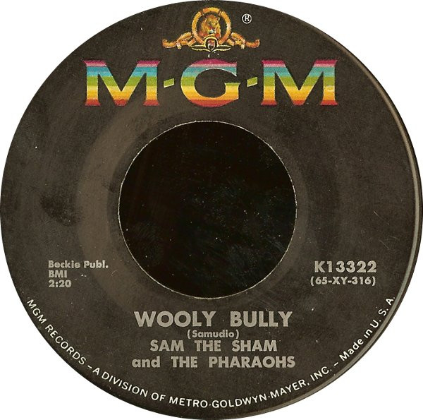

# Wooly Bully / Ain't Gonna Move

By Sam The Sham & The Pharaohs

## Album Data

[Discogs URL](https://www.discogs.com/release/1212742-Sam-The-Sham-And-The-Pharaohs-Wooly-Bully-Aint-Gonna-Move)

- Label: MGM Records
- Formats: Vinyl, 7", Single, 45 RPM
- Genres: Rock, Rock & Roll
- Rating: 4.16
- Released: 1965
- Year: 1965
- Release ID: 1212742
- Media condition: 
- Sleeve condition: 
- Speed: 
- Weight: 
- Notes: 

## Album Tracks

| **Position** | **Title** | **Duration** |
|--------------|-----------|--------------|
| A | **Wooly Bully** | 2:20 |
| B | **Ain't Gonna Move** | 2:05 |

