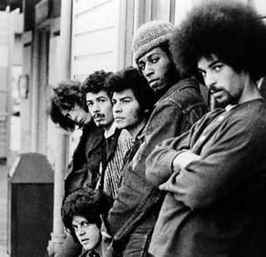

# Santana

## Artist Profile

American latin-rock group, formed in the late 1960s, led by guitarist Carlos Santana.
They first came to wide public attention after their performance at the Woodstock Festival in 1969. This initial exposure made their first, eponymous album a hit at the time, followed in the next two years by “Abraxas” and “Santana III”.

After three highly acclaimed albums that saw them successfully fuse rock with jazz and Latin music, the band Santana underwent a few changes. Bassist David Brown and percussionist Michael Carabello both left, and during the recording of the fourth album their roles were taken over by various musicians. Meanwhile keyboardist & vocalist Gregg Rolie was starting to fall out with Carlos Santana himself. The end result was a very different album from the first three, not really representing the sound of a unified band. Instead it came across more as a loose jam session between a large cast of musicians, with the band's jazz leanings well to the front, and only three vocal songs among seven instrumentals. It made for a great record, but lacking anything that could be considered for a single release it was unsurprisingly not a commercial success.

Ultimately Caravanserai marked the start of a new chapter in Santana's career, as the band moved away from rock and towards a more experimental and complex sound. Both Gregg Rolie and guitarist Neal Schon left the group after its release - they went on to become founding members of Journey. Over the next few years, lineup changes were common. Although retaining a basis of latin rock, Carlos Santana’s increasing involvement with guru Sri Chinmoy took the band further into more esoteric music, which continued for many years, although never quite losing the initial latin influence.

Santana left Columbia in 1991 and signed with Polydor. Though he ended his association with Sri Chimnoy in 1982, he remained intensely spiritual, especially during his live performances. In 1994, he played at the commemorative concert at Woodstock, 25 years after his band's transformative performance at the original festival. In 1998, the group was inducted into the Rock & Roll Hall of Fame, with Carlos Santana, Jose Chepito Areas, David Brown, Mike Carabello, Gregg Rolie and Michael Shrieve being honored.

Santana has achieved a total of eight Grammy Awards and three Latin Grammy Awards which were all awarded in 2000. Carlos also won two Grammy Awards as a solo artist in 1989 and 2003. With the 2014 release of Corazón, Santana surpassed the Rolling Stones and is one of only two music acts in Billboard history to score at least one Top Ten album for six consecutive decades from the 1960s on. Among other honors, Carlos Santana is #20 on Rolling Stone’s list of the “100 Greatest Guitarists of All Time”.

April 15, 2016 marks the release date of Santana - Santana IV, the wildly anticipated studio album that reunites the revered early ’70s lineup. The album signifies the first time in 45 years – since 1971’s multi-platinum classic Santana III – that the quintet has recorded together.
Nearly five decades after their Woodstock debut, Santana, paid homage to the motherland on 2019 release Africa Speaks by enlisting African musicians, and the Spanish siren, Buika. With a mostly Spanish-language tracklist, Africa Speaks debuted at No. 3 on the Billboard 200 and simultaneously crowned the Top Latin Albums chart. Rick Rubin produced sessions of its live instrumentation in his renowned recording studio, Shangri-La, in Malibu, California. Santana again played at Bethel New York for the Woodstock 50th anniversary.

## Artist Links

- [https://www.santana.com/](https://www.santana.com/)
- [https://www.facebook.com/carlossantana](https://www.facebook.com/carlossantana)
- [https://twitter.com/SantanaCarlos](https://twitter.com/SantanaCarlos)
- [https://www.youtube.com/channel/UCty_FzLdVEPlsUMg1O8eEgA](https://www.youtube.com/channel/UCty_FzLdVEPlsUMg1O8eEgA)
- [https://en.wikipedia.org/wiki/Santana_(band)](https://en.wikipedia.org/wiki/Santana_(band))
- [https://santanapurplep.bandcamp.com/](https://santanapurplep.bandcamp.com/)
- [https://www.imdb.com/name/nm2065073/](https://www.imdb.com/name/nm2065073/)
- [https://www.whosampled.com/Santana/](https://www.whosampled.com/Santana/)

## See also

- [Abraxas](Abraxas.md)
- [Woodstock (Saturday, August 16, 1969)](Woodstock_Saturday__August_16__1969.md)
