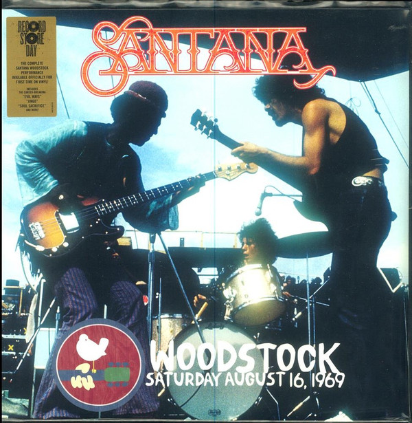

# Woodstock (Saturday, August 16, 1969)

By Santana

## Album Data

[Discogs URL](https://www.discogs.com/release/10168661-Santana-Woodstock-Saturday-August-16-1969)

- Label: Columbia
Legacy
- Formats: Vinyl, LP, Album
- Genres: Rock, Latin
- Rating: 4.73
- Released: 2017-04-22
- Year: 2017
- Release ID: 10168661
- Media condition: 
- Sleeve condition: 
- Speed: 
- Weight: 
- Notes: 

## Album Tracks

| **Position** | **Title** | **Duration** |
|--------------|-----------|--------------|
| A1 | **Waiting** | 4:49 |
| A2 | **Evil Ways** | 4:00 |
| A3 | **You Just Don't Care** | 4:46 |
| A4 | **Savor** | 5:23 |
| A5 | **Jingo** | 5:31 |
| B1 | **Persuasion** | 2:52 |
| B2 | **Soul Sacrifice** | 11:35 |
| B3 | **Fried Neck Bones And Some Home Fries** | 6:41 |

## Artist Roles

| **Name** | **Role** |
|----------|----------|
| **Rob Santos** | A&R [Legacy] |
| **Steve Berkowitz** | A&R [Legacy] |
| **Mark Larson** | Art Direction, Design |
| **Adam Farber** | Art Direction, Directed By |
| **Jim Parham** | Directed By |
| **Lee Osborne (2)** | Engineer [Location Recording] |
| **SST (8)** | Lacquer Cut By |
| **Vic Anesini** | Mastered By |
| **Hanley Sound, Inc.** | Other [Original 8 Track Recording] |
| **Camera 5** | Photography By [Back Cover] |
| **Ken Regan** | Photography By [Back Cover] |
| **Shelly Rusten** | Photography By [Front Cover] |
| **Elliott Landy** | Photography By [Insert Crowd Photo] |
| **Bob Irwin** | Producer |
| **Eddie Kramer** | Supervised By, Mixed By |

