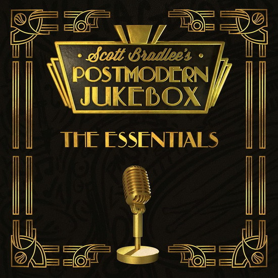

# The Essentials

By Scott Bradlee & Postmodern Jukebox

## Album Data

[Discogs URL](https://www.discogs.com/release/9252508-Scott-Bradlees-Postmodern-Jukebox-The-Essentials)

- Label: Concord Music Group, Inc.
- Formats: Vinyl, LP, Compilation, Stereo
- Genres: Jazz, Swing, Big Band
- Rating: 4.44
- Released: 2016-09-30
- Year: 2016
- Release ID: 9252508
- Media condition: 
- Sleeve condition: 
- Speed: 
- Weight: 
- Notes: 

## Album Tracks

| **Position** | **Title** | **Duration** |
|--------------|-----------|--------------|
| A1 | **We Can't Stop** |  |
| A2 | **Maps** |  |
| A3 | **Creep** |  |
| A4 | **All About That Bass** |  |
| A5 | **No Diggity** |  |
| B1 | **I Believe In A Thing Called Love** |  |
| B2 | **My Heart Will Go On** |  |
| B3 | **Royals** |  |
| B4 | **Stacy's Mom** |  |
| B5 | **Rude** |  |
| C1 | **Sweet Child O'Mine** |  |
| C2 | **Thrift Shop** |  |
| C3 | **Burn** |  |
| C4 | **Seven Nation Army** |  |
| D1 | **Sorry** |  |
| D2 | **Halo** |  |
| D3 | **Hey Ya!** |  |
| D4 | **Such Great Heights** |  |

## Artist Roles

| **Name** | **Role** |
|----------|----------|
| **Scott Bradlee** | Producer, Arranged By, Mixed By, Mastered By |

